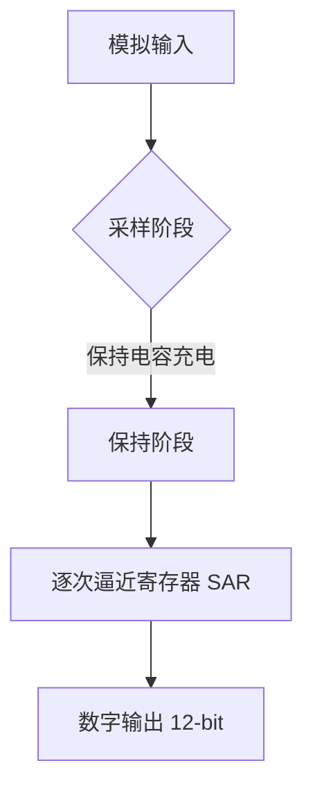

# 第十五章 ADC介绍及应用

## 1. ADC 简介

ADC（Analog-to-Digital Converter，模数转换器）是 STM32H750VBT6 中用于将**模拟信号转换为数字值**的核心外设，支持高精度、多通道、高速采样，是传感器采集（温度、压力、电流）、音频处理、电池管理等应用的“感知器官”。STM32H750VBT6 配备 **3 个独立 ADC**（ADC1/2/3），支持 **16 个外部通道 + 6 个内部信号**，具备 **12-bit 分辨率**、**最高 3.6 MSPS** 采样率，可通过 **同步模式** 实现更高吞吐量。

> 🔍 **核心定位**：
> 
> - **ADC ≠ 普通电压测量**，而是**高精度、多模式的数据采集引擎**
> - 支持 **单次、连续、扫描、间断** 等多种转换模式
> - 可与 **DMA、定时器、DMA2D** 协同实现**零 CPU 开销采集**
> - 支持 **硬件过采样**（提高有效分辨率至 16-bit）

---

### 1.1 ADC 核心特性（STM32H750VBT6）

| **特性**         | **参数**                | **说明**                 | **应用场景**  |
| -------------- | --------------------- | ---------------------- | --------- |
| **分辨率**        | 12-bit                | 输出 0–4095              | 通用测量      |
| **采样率**        | 最高 **3.6 MSPS**（超速模式） | 依赖时钟源（ADCCLK）          | 高速信号采集    |
| **输入范围**       | 0–3.3 V（VREF+）        | 单端输入，参考电压可外接           | 精密测量      |
| **通道数**        | 16 外部 + 6 内部          | 支持多路复用                 | 多传感器系统    |
| **转换模式**       | 单次、连续、扫描、间断           | 灵活控制采集逻辑               | 不同任务需求    |
| **触发源**        | 软件、定时器、EXTI、RTC       | 实现定时采集                 | 同步控制      |
| **DMA 支持**     | ✅                     | 零 CPU 开销数据流            | 高速数据采集    |
| **硬件过采样**      | ✅                     | 4–1024 倍过采样，提升至 16-bit | 精密测量（如温度） |
| **双/三 ADC 模式** | 支持同步采样                | 提高吞吐量（>7 MSPS）         | 电机控制、音频   |

📌 **STM32H750VBT6 专属优势**：

- **多电源域优化**：ADC 电源（VDDA）独立，降低噪声
- **可编程采样时间**：1.5–601.5 ADC 时钟周期，适应不同阻抗源
- **注入通道**：支持高优先级“中断式”采样（如故障检测）
- **模拟看门狗**：硬件级阈值检测，触发中断
- **与 FMC/DMA2D 协同**：可直接为图形显示提供数据源

---

### 1.2 ADC 工作原理详解

#### 1.2.1 转换流程



- **采样时间**（Sampling Time）：
  - 由 `SMPR1/SMPR2` 配置（如 `SMP[2:0]=100` → 480.5 周期）
  - **总转换时间**：`T<sub>conv</sub> = 采样时间 + 12.5 周期`  
    *示例：采样时间=480.5, ADCCLK=100MHz → T<sub>conv</sub> = 5.1 μs → 195 kSPS*

#### 1.2.2 通道配置模式

| **模式**   | **SQRx**    | **JSQR** | **触发方式**   | **应用场景**  |
| -------- | ----------- | -------- | ---------- | --------- |
| **规则通道** | ✅           | ❌        | 主序列（常规采样）  | 多通道轮询     |
| **注入通道** | ❌           | ✅        | 高优先级（中断触发） | 故障检测、电流采样 |
| **联合模式** | SQRx + JSQR | 注入嵌套规则   | 复杂时序       | 电机控制      |

- **扫描模式**：
  
  - `SCAN=1` → 自动顺序转换 `SQR1–SQR4` 中配置的通道
  - 适合多通道采集（如 8 路传感器）

- **间断模式**：
  
  - 每 N 次触发执行一个通道转换
  - 防止长序列阻塞系统

#### 1.2.3 时钟与性能模式

- **ADCCLK 来源**：
  
  - 由 `RCC_D2CCIP2R.ADCSEL` 选择：
    - `00` = PLL2P
    - `01` = PLL3R
    - `10` = PerCK

- **速度模式**：
  
  - **默认模式**：≤ 56 MHz → 3.6 MSPS
  - **超速模式**：≤ 70 MHz → 3.6 MSPS（需开启 `BOOST`）

---

### 1.3 关键寄存器操作

#### 1.3.1 ADC 主要寄存器

| **寄存器**   | **关键位域**                            | **功能**         | **说明**             |
| --------- | ----------------------------------- | -------------- | ------------------ |
| **CR**    | ADEN, ADSTART, JADSTART             | 启动 ADC、开始转换    | `ADSTART=1` 触发规则转换 |
| **CFGR**  | DMACFG, CONT, OVRMOD, EXTSEL, ALIGN | DMA 使能、连续模式、对齐 | `DMACFG=1` 双缓冲     |
| **SMPRx** | SMP[18:0]                           | 通道 0–18 采样时间   | 1.5–601.5 周期       |
| **SQRx**  | SQ1–SQ16                            | 规则通道序列         | 最多 16 个通道          |
| **JSQR**  | JSQ1–JSQ4, JL                       | 注入通道序列         | 最多 4 个通道           |
| **DR**    | RDATA[15:0]                         | 规则数据寄存器        | 仅单通道时使用            |
| **JDRx**  | JDATA[15:0]                         | 注入数据寄存器        | 4 个独立寄存器           |
| **ISR**   | EOC, JEOC, OVR, AWD1                | 转换完成、溢出、看门狗    | 必须在 ISR 中清除        |
| **IER**   | EOCIE, JEOCIE, OVRIE                | 中断使能           | 与 NVIC 协同          |

#### 1.3.2 配置步骤（ADC1 单通道连续采样）

```c
// 1. 使能 ADC 时钟
RCC->AHB1ENR |= RCC_AHB1ENR_ADC12EN;

// 2. 配置 PA0 为模拟输入
GPIOA->MODER |= GPIO_MODER_MODER0; // [1:0]=11 → 模拟
GPIOA->PUPDR &= ~GPIO_PUPDR_PUPD0; // 无上下拉

// 3. 配置 ADC 时钟源（PLL2P）
RCC->D2CCIP2R &= ~RCC_D2CCIP2R_ADCSEL;
RCC->D2CCIP2R |= 0 << 16; // 00 = PLL2P

// 4. 配置 ADC1
ADC1->CR &= ~ADC_CR_DEEPPWD; // 退出掉电模式
ADC1->CR |= ADC_CR_ADVREGEN; // 使能稳压器
HAL_Delay(10); // 稳定时间

// 5. 进入校准模式
ADC1->CR |= ADC_CR_ADCAL;
while (ADC1->CR & ADC_CR_ADCAL); // 等待校准完成

// 6. 配置采样时间（通道 0）
ADC1->SMPR1 = 4 << 0; // SMP0=100 → 480.5 周期

// 7. 配置规则序列（通道 0，1 次转换）
ADC1->SQR1 = 0 << 6; // SQ1 = 0

// 8. 配置连续模式 + DMA
ADC1->CFGR |= ADC_CFGR_CONT | ADC_CFGR_DMEN;

// 9. 使能 ADC
ADC1->CR |= ADC_CR_ADEN;
while (!(ADC1->ISR & ADC_ISR_ADRDY)); // 等待就绪

// 10. 启动转换
ADC1->CR |= ADC_CR_ADSTART;
```

#### 1.3.3 HAL 库简化操作

```c
ADC_HandleTypeDef hadc1;
ADC_ChannelConfTypeDef sConfig = {0};

hadc1.Instance = ADC1;
hadc1.Init.ClockPrescaler = ADC_CLOCK_ASYNC_DIV1;
hadc1.Init.Resolution = ADC_RESOLUTION_12B;
hadc1.Init.DataAlign = ADC_DATAALIGN_RIGHT;
hadc1.Init.ScanConvMode = ADC_SCAN_DISABLE;
hadc1.Init.EOCSelection = ADC_EOC_SINGLE_CONV;
hadc1.Init.LowPowerAutoWait = DISABLE;
hadc1.Init.ContinuousConvMode = ENABLE;
hadc1.Init.NbrOfConversion = 1;

HAL_ADC_Init(&hadc1);

sConfig.Channel = ADC_CHANNEL_0;
sConfig.Rank = ADC_REGULAR_RANK_1;
sConfig.SamplingTime = ADC_SAMPLETIME_480CYCLES_5;
sConfig.SingleDiff = ADC_SINGLE_ENDED;
sConfig.OffsetNumber = ADC_OFFSET_NONE;
HAL_ADC_ConfigChannel(&hadc1, &sConfig);

// 启动 DMA 采集
HAL_ADC_Start_DMA(&hadc1, (uint32_t*)adc_buffer, 1000);
```

## 2. ADC使用示例-STM32IDE

### 2.1 STM32Cube配置


### 2.2 用户代码

```c
/* USER CODE BEGIN Header */
/**
  ******************************************************************************
  * @file    adc.c
  * @brief   This file provides code for the configuration
  *          of the ADC instances.
  ******************************************************************************
  * @attention
  *
  * Copyright (c) 2025 STMicroelectronics.
  * All rights reserved.
  *
  * This software is licensed under terms that can be found in the LICENSE file
  * in the root directory of this software component.
  * If no LICENSE file comes with this software, it is provided AS-IS.
  *
  ******************************************************************************
  */
/* USER CODE END Header */
/* Includes ------------------------------------------------------------------*/
#include "adc.h"

/* USER CODE BEGIN 0 */

/* USER CODE END 0 */

ADC_HandleTypeDef hadc1;

/**
 * @brief       ADC初始化函数
 *   @note      本函数支持ADC1/ADC2任意通道,但是不支持ADC3
 *              我们使用16位精度, ADC采样时钟=32M, 转换时间为:采样周期 + 8.5个ADC周期
 *              设置最大采样周期: 810.5, 则转换时间 = 819个ADC周期 = 25.6us
 * @param       无
 * @retval      无
 */
void MX_ADC1_Init(void)
{
  hadc1.Instance = ADC1;                                          // 选择ADC1
  hadc1.Init.ClockPrescaler = ADC_CLOCK_ASYNC_DIV2;               // 输入时钟2分频
  hadc1.Init.Resolution = ADC_RESOLUTION_16B;                     // 16位模式
  hadc1.Init.ScanConvMode = ADC_SCAN_DISABLE;                     // 非扫描模式
  hadc1.Init.EOCSelection = ADC_EOC_SINGLE_CONV;                  // 关闭EOC中断
  hadc1.Init.LowPowerAutoWait = DISABLE;                          // 自动低功耗关闭
  hadc1.Init.ContinuousConvMode = DISABLE;                        // 关闭连续转换模式
  hadc1.Init.NbrOfConversion = 1;                                 // 通道数
  hadc1.Init.DiscontinuousConvMode = DISABLE;                     // 禁止常规转换组不连续采样模式
  hadc1.Init.NbrOfDiscConversion = 0;                			  // 不连续采样模式的通道数
  hadc1.Init.ExternalTrigConv = ADC_SOFTWARE_START;               // 软件触发
  hadc1.Init.ExternalTrigConvEdge = ADC_EXTERNALTRIGCONVEDGE_NONE;// 外部触发
  hadc1.Init.ConversionDataManagement = ADC_CONVERSIONDATA_DR;    // 常规通道的数据仅仅保存在DR寄存器里面
  hadc1.Init.Overrun = ADC_OVR_DATA_PRESERVED;                    // 有新的数据后直接覆盖掉旧数据
  hadc1.Init.LeftBitShift = ADC_LEFTBITSHIFT_NONE;                // 设置ADC转换结果的左移位数
  hadc1.Init.OversamplingMode = DISABLE;                          // 关闭过采样
  hadc1.Init.Oversampling.Ratio = 1;
  if (HAL_ADC_Init(&hadc1) != HAL_OK)
  {
    Error_Handler();
  }
  HAL_ADCEx_Calibration_Start(&hadc1, ADC_CALIB_OFFSET, ADC_SINGLE_ENDED); // ADC校准
}
/**
 * @brief       获得ADC转换后的结果
 * @param       ch: 通道值 0~19，取值范围为：ADC_CHANNEL_0~ADC_CHANNEL_19
 * @retval      返回值:转换结果
 */
uint32_t MX_ADC1_result(uint32_t ch)
{
  ADC_ChannelConfTypeDef sConfig = {0};
  /** Configure Regular Channel
  */
  sConfig.Channel = ch; // 通道
  sConfig.Rank = ADC_REGULAR_RANK_1; // 序列
  sConfig.SamplingTime = ADC_SAMPLETIME_810CYCLES_5; // 采样时间
  sConfig.SingleDiff = ADC_SINGLE_ENDED; // 单边采集
  sConfig.OffsetNumber = ADC_OFFSET_NONE; // 不使用偏移量的通道
  sConfig.Offset = 0; // 偏移量为0
  sConfig.OffsetSignedSaturation = DISABLE;
  if (HAL_ADC_ConfigChannel(&hadc1, &sConfig) != HAL_OK)
  {
    Error_Handler();
  }
  HAL_ADC_Start(&hadc1);
  HAL_ADC_PollForConversion(&hadc1, 10); // 轮询准换
  return HAL_ADC_GetValue(&hadc1);
}

void HAL_ADC_MspInit(ADC_HandleTypeDef* adcHandle)
{
  if(adcHandle->Instance == ADC1)
  {
	GPIO_InitTypeDef GPIO_InitStruct;
    __HAL_RCC_ADC12_CLK_ENABLE();
    __HAL_RCC_GPIOA_CLK_ENABLE();
    __HAL_RCC_ADC_CONFIG(RCC_ADCCLKSOURCE_CLKP);
    /**ADC1 GPIO Configuration
    PA5     ------> ADC1_INP19
    */
    GPIO_InitStruct.Pin = GPIO_PIN_5;
    GPIO_InitStruct.Mode = GPIO_MODE_ANALOG;
    GPIO_InitStruct.Pull = GPIO_NOPULL;
    HAL_GPIO_Init(GPIOA, &GPIO_InitStruct);
  }
}

void HAL_ADC_MspDeInit(ADC_HandleTypeDef* adcHandle)
{

  if(adcHandle->Instance==ADC1)
  {
  /* USER CODE BEGIN ADC1_MspDeInit 0 */

  /* USER CODE END ADC1_MspDeInit 0 */
    /* Peripheral clock disable */
    __HAL_RCC_ADC12_CLK_DISABLE();

    /**ADC1 GPIO Configuration
    PA5     ------> ADC1_INP19
    */
    HAL_GPIO_DeInit(GPIOA, GPIO_PIN_5);

  /* USER CODE BEGIN ADC1_MspDeInit 1 */

  /* USER CODE END ADC1_MspDeInit 1 */
  }
}

/* USER CODE BEGIN 1 */
/**
 * @brief       获取通道ch的转换值，取times次,然后平均
 * @param       ch      : 通道号, 0~19
 * @param       times   : 获取次数
 * @retval      通道ch的times次转换结果平均值
 */
uint32_t adc_get_result_average(uint32_t ch, uint8_t times)
{
    uint32_t temp_val = 0;
    uint8_t t;

    for (t = 0; t < times; t++) /* 获取times次数据 */
    {
        temp_val += MX_ADC1_result(ch);
        HAL_Delay(5);
    }
    return temp_val / times;    /* 返回平均值 */
}
/* USER CODE END 1 */

```

```c
/* USER CODE BEGIN Header */
/**
  ******************************************************************************
  * @file           : main.c
  * @brief          : Main program body
  ******************************************************************************
  * @attention
  *
  * Copyright (c) 2025 STMicroelectronics.
  * All rights reserved.
  *
  * This software is licensed under terms that can be found in the LICENSE file
  * in the root directory of this software component.
  * If no LICENSE file comes with this software, it is provided AS-IS.
  *
  ******************************************************************************
  */
/* USER CODE END Header */
/* Includes ------------------------------------------------------------------*/
#include "main.h"
#include "adc.h"

/* Private includes ----------------------------------------------------------*/
/* USER CODE BEGIN Includes */
#include "bsp_init.h"
#include "stdio.h" // For printf function
/* USER CODE END Includes */

/* Private typedef -----------------------------------------------------------*/
/* USER CODE BEGIN PTD */

/* USER CODE END PTD */

/* Private define ------------------------------------------------------------*/
/* USER CODE BEGIN PD */

/* USER CODE END PD */

/* Private macro -------------------------------------------------------------*/
/* USER CODE BEGIN PM */

/* USER CODE END PM */

/* Private variables ---------------------------------------------------------*/

/* USER CODE BEGIN PV */

/* USER CODE END PV */

/* Private function prototypes -----------------------------------------------*/
void SystemClock_Config(void);
static void MPU_Config(void);
/* USER CODE BEGIN PFP */

/* USER CODE END PFP */

/* Private user code ---------------------------------------------------------*/
/* USER CODE BEGIN 0 */
/* USER CODE END 0 */

/**
  * @brief  The application entry point.
  * @retval int
  */
int main(void)
{
  uint16_t adc_value;
  //float temp;
  /* USER CODE BEGIN 1 */
  /* USER CODE END 1 */

  /* MPU Configuration--------------------------------------------------------*/
  MPU_Config();

  /* MCU Configuration--------------------------------------------------------*/

  /* Reset of all peripherals, Initializes the Flash interface and the Systick. */
  HAL_Init();

  /* USER CODE BEGIN Init */

  /* USER CODE END Init */

  /* Configure the system clock */
  SystemClock_Config();

  /* USER CODE BEGIN SysInit */

  /* USER CODE END SysInit */

  /* Initialize all configured peripherals */

  /* USER CODE BEGIN 2 */
  bsp_init();
  MX_ADC1_Init();
  printf("ADC Test\r\n");
  /* USER CODE END 2 */

  /* Infinite loop */
  /* USER CODE BEGIN WHILE */
  while (1)
  {
	  adc_value = adc_get_result_average(ADC_CHANNEL_19, 10);
	  printf("adc_value: %d\r\n", adc_value);
	  // 电压转换：直接计算电压值（伏特）
	  float voltage = (float)adc_value * (3.3f / 65536.0f);
	  printf("v: %.3f V\r\n", voltage); // 打印3位小数的电压值
	  HAL_GPIO_TogglePin(LED_RED_Port, LED_RED_Pin);
	  HAL_Delay(200);
  }
}

/**
  * @brief System Clock Configuration
  * @retval None
  */
void SystemClock_Config(void)
{
  RCC_OscInitTypeDef RCC_OscInitStruct = {0};
  RCC_ClkInitTypeDef RCC_ClkInitStruct = {0};

  /** Supply configuration update enable
  */
  HAL_PWREx_ConfigSupply(PWR_LDO_SUPPLY);

  /** Configure the main internal regulator output voltage
  */
  __HAL_PWR_VOLTAGESCALING_CONFIG(PWR_REGULATOR_VOLTAGE_SCALE0);

  while(!__HAL_PWR_GET_FLAG(PWR_FLAG_VOSRDY)) {}

  /** Initializes the RCC Oscillators according to the specified parameters
  * in the RCC_OscInitTypeDef structure.
  */
  RCC_OscInitStruct.OscillatorType = RCC_OSCILLATORTYPE_LSI|RCC_OSCILLATORTYPE_HSE;
  RCC_OscInitStruct.HSEState = RCC_HSE_ON;
  RCC_OscInitStruct.LSIState = RCC_LSI_ON;
  RCC_OscInitStruct.PLL.PLLState = RCC_PLL_ON;
  RCC_OscInitStruct.PLL.PLLSource = RCC_PLLSOURCE_HSE;
  RCC_OscInitStruct.PLL.PLLM = 2;
  RCC_OscInitStruct.PLL.PLLN = 240;
  RCC_OscInitStruct.PLL.PLLP = 2;
  RCC_OscInitStruct.PLL.PLLQ = 2;
  RCC_OscInitStruct.PLL.PLLR = 2;
  RCC_OscInitStruct.PLL.PLLRGE = RCC_PLL1VCIRANGE_2;
  RCC_OscInitStruct.PLL.PLLVCOSEL = RCC_PLL1VCOWIDE;
  RCC_OscInitStruct.PLL.PLLFRACN = 0;
  if (HAL_RCC_OscConfig(&RCC_OscInitStruct) != HAL_OK)
  {
    Error_Handler();
  }

  /** Initializes the CPU, AHB and APB buses clocks
  */
  RCC_ClkInitStruct.ClockType = RCC_CLOCKTYPE_HCLK|RCC_CLOCKTYPE_SYSCLK
                              |RCC_CLOCKTYPE_PCLK1|RCC_CLOCKTYPE_PCLK2
                              |RCC_CLOCKTYPE_D3PCLK1|RCC_CLOCKTYPE_D1PCLK1;
  RCC_ClkInitStruct.SYSCLKSource = RCC_SYSCLKSOURCE_PLLCLK;
  RCC_ClkInitStruct.SYSCLKDivider = RCC_SYSCLK_DIV1;
  RCC_ClkInitStruct.AHBCLKDivider = RCC_HCLK_DIV2;
  RCC_ClkInitStruct.APB3CLKDivider = RCC_APB3_DIV2;
  RCC_ClkInitStruct.APB1CLKDivider = RCC_APB1_DIV2;
  RCC_ClkInitStruct.APB2CLKDivider = RCC_APB2_DIV2;
  RCC_ClkInitStruct.APB4CLKDivider = RCC_APB4_DIV2;

  if (HAL_RCC_ClockConfig(&RCC_ClkInitStruct, FLASH_LATENCY_4) != HAL_OK)
  {
    Error_Handler();
  }
}

/* USER CODE BEGIN 4 */

/* USER CODE END 4 */

 /* MPU Configuration */

void MPU_Config(void)
{
  MPU_Region_InitTypeDef MPU_InitStruct = {0};

  /* Disables the MPU */
  HAL_MPU_Disable();

  /** Initializes and configures the Region and the memory to be protected
  */
  MPU_InitStruct.Enable = MPU_REGION_ENABLE;
  MPU_InitStruct.Number = MPU_REGION_NUMBER0;
  MPU_InitStruct.BaseAddress = 0x0;
  MPU_InitStruct.Size = MPU_REGION_SIZE_4GB;
  MPU_InitStruct.SubRegionDisable = 0x87;
  MPU_InitStruct.TypeExtField = MPU_TEX_LEVEL0;
  MPU_InitStruct.AccessPermission = MPU_REGION_NO_ACCESS;
  MPU_InitStruct.DisableExec = MPU_INSTRUCTION_ACCESS_DISABLE;
  MPU_InitStruct.IsShareable = MPU_ACCESS_SHAREABLE;
  MPU_InitStruct.IsCacheable = MPU_ACCESS_NOT_CACHEABLE;
  MPU_InitStruct.IsBufferable = MPU_ACCESS_NOT_BUFFERABLE;

  HAL_MPU_ConfigRegion(&MPU_InitStruct);
  /* Enables the MPU */
  HAL_MPU_Enable(MPU_PRIVILEGED_DEFAULT);

}

/**
  * @brief  This function is executed in case of error occurrence.
  * @retval None
  */
void Error_Handler(void)
{
  /* USER CODE BEGIN Error_Handler_Debug */
  /* User can add his own implementation to report the HAL error return state */
  __disable_irq();
  while (1)
  {
  }
  /* USER CODE END Error_Handler_Debug */
}
#ifdef USE_FULL_ASSERT
/**
  * @brief  Reports the name of the source file and the source line number
  *         where the assert_param error has occurred.
  * @param  file: pointer to the source file name
  * @param  line: assert_param error line source number
  * @retval None
  */
void assert_failed(uint8_t *file, uint32_t line)
{
  /* USER CODE BEGIN 6 */
  /* User can add his own implementation to report the file name and line number,
     ex: printf("Wrong parameters value: file %s on line %d\r\n", file, line) */
  /* USER CODE END 6 */
}
#endif /* USE_FULL_ASSERT */

```

## 3. ADC相关函数总结（HAL库）

### 3.1 初始化与配置

- **核心配置流程**（五步关键操作）：
  
  1. **使能时钟**（ADC + GPIO）
  2. **配置ADC参数**（分辨率/扫描模式/对齐方式等）
  3. **配置通道参数**（采样时间/通道选择）
  4. **初始化ADC**
  5. **校准ADC**（推荐执行）

- `HAL_ADC_Init(ADC_HandleTypeDef *hadc)`  
  **基础配置示例**（ADC1单通道连续转换）：
  
  ```c
  // 1. 使能ADC和GPIO时钟
  __HAL_RCC_ADC12_CLK_ENABLE();
  __HAL_RCC_GPIOA_CLK_ENABLE();
  
  // 2. 配置GPIO（模拟输入）
  GPIO_InitTypeDef GPIO_InitStruct = {0};
  GPIO_InitStruct.Pin = GPIO_PIN_0;
  GPIO_InitStruct.Mode = GPIO_MODE_ANALOG;
  GPIO_InitStruct.Pull = GPIO_NOPULL;
  HAL_GPIO_Init(GPIOA, &GPIO_InitStruct);
  
  // 3. 配置ADC参数
  hadc1.Instance = ADC1;
  hadc1.Init.ClockPrescaler = ADC_CLOCK_SYNC_PCLK_DIV4;     // 时钟分频
  hadc1.Init.Resolution = ADC_RESOLUTION_16B;               // 16位分辨率
  hadc1.Init.ScanConvMode = ADC_SCAN_DISABLE;               // 单通道
  hadc1.Init.EOCSelection = ADC_EOC_SINGLE_CONV;            // 单次转换结束
  hadc1.Init.ContinuousConvMode = ENABLE;                   // 连续转换
  hadc1.Init.NbrOfConversion = 1;                           // 转换次数
  hadc1.Init.DiscontinuousConvMode = DISABLE;               // 禁用间断模式
  hadc1.Init.ExternalTrigConv = ADC_SOFTWARE_START;         // 软件触发
  hadc1.Init.ExternalTrigConvEdge = ADC_EXTERNALTRIGCONVEDGE_NONE; // 无边沿
  hadc1.Init.ConversionDataManagement = ADC_CONVERSIONDATA_DR;     // 数据寄存器
  hadc1.Init.Overrun = ADC_OVR_DATA_PRESERVED;              // 覆盖模式
  hadc1.Init.LeftBitShift = ADC_LEFTBITSHIFT_NONE;          // 无左移
  HAL_ADC_Init(&hadc1);
  ```

- **`ADC_InitTypeDef` 结构体成员说明**：
  
  | **成员**                     | **说明** | **关键选项**                             | **H750特殊说明** |
  | -------------------------- | ------ | ------------------------------------ | ------------ |
  | `ClockPrescaler`           | 时钟预分频  | `DIV1`到`DIV512`                      | `DIV4`推荐     |
  | `Resolution`               | 分辨率    | `12/14/16/18位`                       | H750支持18位    |
  | `ScanConvMode`             | 扫描模式   | `ENABLE/DISABLE`                     | 多通道时启用       |
  | `EOCSelection`             | 转换结束标志 | `SINGLE_CONV`, `SEQ_CONV`            | 影响中断行为       |
  | `ContinuousConvMode`       | 连续转换   | `ENABLE/DISABLE`                     | 单次/连续        |
  | `NbrOfConversion`          | 转换通道数  | 1-20                                 | 扫描模式下有效      |
  | `ExternalTrigConv`         | 外部触发   | `ADC_SOFTWARE_START`, `TIMx_CCy`     | 同步采样         |
  | `ConversionDataManagement` | 数据管理   | `DR`, `DMA_ONESHOT`, `FIFO_½FULL`    | FIFO模式高效     |
  | `Overrun`                  | 覆盖处理   | `DATA_PRESERVED`, `DATA_OVERWRITTEN` | 建议保留         |

- **ADC时钟配置**（核心！）：
  
  - **时钟源**：`ADCCLK = PERIPHCLK / (PRESC + 1)`
  
  - **最大频率**：
    
    - 18位分辨率：≤ 3.6MHz
    - 16位分辨率：≤ 7.2MHz
    - 12位分辨率：≤ 36MHz
  
  - **典型配置**（H750）：
    
    ```c
    hadc1.Init.ClockPrescaler = ADC_CLOCK_SYNC_PCLK_DIV4;  // 100MHz→25MHz
    ```

- **通道配置**：
  
  ```c
  // 配置ADC通道
  ADC_ChannelConfTypeDef sConfig = {0};
  sConfig.Channel = ADC_CHANNEL_0;                        // PA0
  sConfig.Rank = ADC_REGULAR_RANK_1;                      // 第1个转换
  sConfig.SamplingTime = ADC_SAMPLETIME_810CYCLES_5;      // 采样时间
  sConfig.SingleDiff = ADC_SINGLE_ENDED;                  // 单端输入
  sConfig.OffsetNumber = ADC_OFFSET_NONE;                 // 无偏移
  sConfig.Offset = 0;
  HAL_ADC_ConfigChannel(&hadc1, &sConfig);
  ```

### 3.2 ADC操作核心函数

- **基础启停控制**：
  
  | **函数**                        | **原型**                   | **特点** | **应用场景** |
  | ----------------------------- | ------------------------ | ------ | -------- |
  | `HAL_ADC_Start()`             | `(hadc)`                 | 软件启动   | 单次转换     |
  | `HAL_ADC_Start_IT()`          | `(hadc)`                 | 启动+中断  | 转换完成通知   |
  | `HAL_ADC_Start_DMA()`         | `(hadc, *pData, Length)` | 启动+DMA | 大数据量采集   |
  | `HAL_ADC_Stop()`              | `(hadc)`                 | 停止转换   |          |
  | `HAL_ADC_PollForConversion()` | `(hadc, Timeout)`        | 轮询等待   | 阻塞式读取    |
  | `HAL_ADC_GetValue()`          | `(hadc)`                 | 获取转换值  | 读取结果     |

- **校准函数**（强烈推荐）：
  
  ```c
  // 单次校准
  HAL_ADCEx_Calibration_Start(&hadc1, ADC_CALIB_OFFSET, ADC_SINGLE_ENDED);
  
  // 等待校准完成
  while (HAL_ADCEx_Calibration_GetStatus(&hadc1) == HAL_BUSY);
  
  // 获取校准因子
  uint32_t cal_factor = HAL_ADCEx_Calibration_GetValue(&hadc1, ADC_SINGLE_ENDED);
  ```

- **注入通道操作**：
  
  ```c
  // 配置注入通道
  ADC_InjectionConfigTypeDef sConfigInjected = {0};
  sConfigInjected.InjectedChannel = ADC_CHANNEL_1;
  sConfigInjected.InjectedRank = ADC_INJECTED_RANK_1;
  sConfigInjected.InjectedSamplingTime = ADC_SAMPLETIME_810CYCLES_5;
  sConfigInjected.InjectedSingleDiff = ADC_SINGLE_ENDED;
  sConfigInjected.AutoInjectedConv = DISABLE;
  sConfigInjected.QueueInjectedContext = DISABLE;
  sConfigInjected.ExternalTrigInjecConv = ADC_INJECTED_SOFTWARE_START;
  sConfigInjected.ExternalTrigInjecConvEdge = ADC_EXTERNALTRIGCONVEDGE_RISING;
  sConfigInjected.InjectedDiscontinuousMode = DISABLE;
  sConfigInjected.InjectedNbrOfConversion = 1;
  sConfigInjected.InjectedOffset = 0;
  sConfigInjected.InjectedOffsetNumber = ADC_OFFSET_NONE;
  HAL_ADCEx_InjectedConfigChannel(&hadc1, &sConfigInjected);
  
  // 启动注入转换
  HAL_ADCEx_InjectedStart(&hadc1);
  ```

- **多ADC同步模式**：
  
  ```c
  // 配置ADC1为主，ADC2为从（同步规则）
  hadc1.Init.DMAContinuousRequests = ENABLE;
  hadc1.Init.DMAMode = ADC_DMA_MODE_CIRCULAR;
  hadc1.Init.MultiMode = ADC_MODE_INDEPENDENT;  // 改为同步模式
  
  // 启动同步转换
  HAL_ADCEx_MultiModeStart_DMA(&hadc1, (uint32_t*)dual_adc_buffer, 1000);
  ```

### **3.3 高级功能与特性**

- **FIFO模式**（H750特有）：
  
  ```c
  // 配置FIFO模式（高效数据采集）
  hadc1.Init.ConversionDataManagement = ADC_CONVERSIONDATA_DMA_ONESHOT;
  hadc1.Instance->CFGR1 |= ADC_CFGR1_DMNGT_1;  // 使能FIFO
  
  // 设置FIFO阈值
  hadc1.Instance->CFGR2 |= ADC_CFGR2_FIFOFULL;
  
  // 启动DMA传输
  HAL_ADC_Start_DMA(&hadc1, (uint32_t*)adc_buffer, BUFFER_SIZE);
  ```

- **硬件过采样**（提高分辨率）：
  
  ```c
  // 配置过采样（18位分辨率）
  ADC_OversamplingTypeDef sOversampling = {0};
  sOversampling.Ratio = ADC_OVERSAMPLING_RATIO_256;       // 256倍过采样
  sOversampling.RightBitShift = ADC_RIGHTBITSHIFT_4;      // 右移4位
  sOversampling.TriggeredMode = ADC_TRIGGEREDMODE_SINGLE_TRIGGER;
  sOversampling.OversamplingStopReset = ADC_REGOVERSAMPLING_CONTINUED_MODE;
  HAL_ADCEx_OversamplingConfig(&hadc1, &sOversampling);
  
  // 分辨率设置为16位（过采样后达18位）
  hadc1.Init.Resolution = ADC_RESOLUTION_16B;
  ```

- **低功耗模式**：
  
  | **模式**              | **功耗** | **启动时间** | **H750配置**             |
  | ------------------- | ------ | -------- | ---------------------- |
  | **Auto Off**        | 极低     | 4μs      | `ADC_AUTOOFF_ENABLE`   |
  | **Deep Power Down** | 最低     | 20μs     | `ADC_DEEPPWD_ENABLE`   |
  | **常规模式**            | 正常     | 1μs      | `ADC_AUTOWAIT_DISABLE` |

- **模拟看门狗**（电压监控）：
  
  ```c
  // 配置模拟看门狗
  ADC_AnalogWDGConfTypeDef AnalogWDGConfig = {0};
  AnalogWDGConfig.WatchdogNumber = ADC_ANALOGWATCHDOG_1;
  AnalogWDGConfig.WatchdogMode = ADC_ANALOGWATCHDOG_SINGLE_REG;
  AnalogWDGConfig.Channel = ADC_CHANNEL_0;
  AnalogWDGConfig.ITMode = ENABLE;  // 使能中断
  AnalogWDGConfig.HighThreshold = 3000;  // 高阈值 (mV)
  AnalogWDGConfig.LowThreshold = 1000;   // 低阈值 (mV)
  HAL_ADC_AnalogWDGConfig(&hadc1, &AnalogWDGConfig);
  
  // 中断回调
  void HAL_ADC_LevelOutOfWindowCallback(ADC_HandleTypeDef *hadc)
  {
      if(hadc->Instance == ADC1) {
          voltage_alarm_handler();
      }
  }
  ```

### 3.4 使用示例（完整流程）

#### 3.4.1 示例1：ADC单通道连续DMA采集

```c
#define ADC_BUFFER_SIZE  1024
uint16_t adc_buffer[ADC_BUFFER_SIZE];
ADC_HandleTypeDef hadc1 = {0};
DMA_HandleTypeDef hdma_adc1 = {0};

// 1. 使能时钟
__HAL_RCC_ADC12_CLK_ENABLE();
__HAL_RCC_GPIOA_CLK_ENABLE();

// 2. 配置GPIO
GPIO_InitTypeDef GPIO_InitStruct = {0};
GPIO_InitStruct.Pin = GPIO_PIN_0;
GPIO_InitStruct.Mode = GPIO_MODE_ANALOG;
GPIO_InitStruct.Pull = GPIO_NOPULL;
HAL_GPIO_Init(GPIOA, &GPIO_InitStruct);

// 3. 配置ADC
hadc1.Instance = ADC1;
hadc1.Init.ClockPrescaler = ADC_CLOCK_SYNC_PCLK_DIV4;
hadc1.Init.Resolution = ADC_RESOLUTION_16B;
hadc1.Init.ScanConvMode = ADC_SCAN_DISABLE;
hadc1.Init.EOCSelection = ADC_EOC_SINGLE_CONV;
hadc1.Init.ContinuousConvMode = ENABLE;
hadc1.Init.NbrOfConversion = 1;
hadc1.Init.DiscontinuousConvMode = DISABLE;
hadc1.Init.ExternalTrigConv = ADC_SOFTWARE_START;
hadc1.Init.ConversionDataManagement = ADC_CONVERSIONDATA_DMA_ONESHOT;
hadc1.Init.Overrun = ADC_OVR_DATA_PRESERVED;
HAL_ADC_Init(&hadc1);

// 4. 配置ADC通道
ADC_ChannelConfTypeDef sConfig = {0};
sConfig.Channel = ADC_CHANNEL_0;
sConfig.Rank = ADC_REGULAR_RANK_1;
sConfig.SamplingTime = ADC_SAMPLETIME_810CYCLES_5;
sConfig.SingleDiff = ADC_SINGLE_ENDED;
sConfig.OffsetNumber = ADC_OFFSET_NONE;
sConfig.Offset = 0;
HAL_ADC_ConfigChannel(&hadc1, &sConfig);

// 5. 校准ADC
HAL_ADCEx_Calibration_Start(&hadc1, ADC_CALIB_OFFSET, ADC_SINGLE_ENDED);
while (HAL_ADCEx_Calibration_GetStatus(&hadc1) == HAL_BUSY);

// 6. 配置DMA
__HAL_RCC_DMA1_CLK_ENABLE();
hdma_adc1.Instance = DMA1_Stream0;
hdma_adc1.Init.Request = DMA_REQUEST_ADC1;
hdma_adc1.Init.Direction = DMA_PERIPH_TO_MEMORY;
hdma_adc1.Init.PeriphInc = DMA_PINC_DISABLE;
hdma_adc1.Init.MemInc = DMA_MINC_ENABLE;
hdma_adc1.Init.PeriphDataAlignment = DMA_PDATAALIGN_HALFWORD;
hdma_adc1.Init.MemDataAlignment = DMA_MDATAALIGN_HALFWORD;
hdma_adc1.Init.Mode = DMA_CIRCULAR;
hdma_adc1.Init.Priority = DMA_PRIORITY_HIGH;
HAL_DMA_Init(&hdma_adc1);

// 7. 链接ADC和DMA
__HAL_LINKDMA(&hadc1, DMA_Handle, hdma_adc1);

// 8. 启动ADC+DMA
HAL_ADC_Start_DMA(&hadc1, (uint32_t*)adc_buffer, ADC_BUFFER_SIZE);
```

#### 3.42 示例2：多通道扫描模式

```c

```

## 4. 关键注意事项

1. **时钟配置陷阱**：
   
   - **H750特殊性**：
     
     ```c
     // ADC时钟 = PERIPHCLK / (PRESC + 1)
     // PERIPHCLK来自D3域
     RCC_PeriphCLKInitTypeDef PeriphClkInitStruct = {0};
     PeriphClkInitStruct.PeriphClockSelection = RCC_PERIPHCLK_ADC;
     PeriphClkInitStruct.PLL2.PLL2M = 2;   // VCO输入
     PeriphClkInitStruct.PLL2.PLL2N = 16;  // VCO倍频
     PeriphClkInitStruct.PLL2.PLL2P = 2;   // ADC分频
     PeriphClkInitStruct.PLL2.PLL2Q = 2;
     PeriphClkInitStruct.PLL2.PLL2R = 2;
     PeriphClkInitStruct.PLL2.PLL2RGE = RCC_PLL2VCIRANGE_2;
     PeriphClkInitStruct.PLL2.PLL2VCOSEL = RCC_PLL2VCOWIDE;
     PeriphClkInitStruct.AdcClockSelection = RCC_ADCCLKSOURCE_PLL2;
     HAL_RCCEx_PeriphCLKConfig(&PeriphClkInitStruct);
     ```

2. **采样时间计算**：
   
   ```c
   采样周期 = (采样时间 + 12.5) / ADCCLK
   ```
   
   **H750示例**（ADCCLK=25MHz, 采样时间=810.5周期）：
   
   - 采样周期 = (810.5 + 12.5) / 25MHz = 32.92μs
   - 最大采样率 ≈ 30.37ksps

3. **DMA传输陷阱**：
   
   - **必须链接DMA句柄**：
     
     ```c
     __HAL_LINKDMA(&hadc1, DMA_Handle, hdma_adc1);
     ```
   
   - **FIFO模式**：数据从`ADC_FIFO_DATA_REG`读取
   
   - **Cache一致性**：
     
     ```c
     SCB_InvalidateDCache_by_Addr((uint32_t*)adc_buffer, buffer_size);
     ```

4. **低功耗模式影响**：
   
   | **模式**  | **ADC行为** | **H750处理** |
   | ------- | --------- | ---------- |
   | RUN     | 正常工作      |            |
   | SLEEP   | 继续运行      |            |
   | STOP0   | **停止**    | 需进入低功耗模式   |
   | STOP1/2 | **停止**    |            |
   | STANDBY | **关闭**    |            |

5. **精度优化技巧**：
   
   - **PCB布局**：  
     ✅ 模拟地单独走线  
     ✅ 远离数字信号线  
     ✅ 加入0.1μF去耦电容
   
   - **软件滤波**：
     
     ```c
     // 移动平均滤波
     static uint32_t buffer[16];
     static uint8_t index = 0;
     buffer[index++] = adc_value;
     if (index >= 16) index = 0;
     uint32_t avg = 0;
     for (int i = 0; i < 16; i++) avg += buffer[i];
     filtered_value = avg >> 4;
     ```

---

### 4.1 H750特有优化技巧

| **场景**   | **解决方案**   | **精度提升** | **实现要点**                         |
| -------- | ---------- | -------- | -------------------------------- |
| **高速采集** | FIFO+DMA   | 采样率↑3倍   | `ADC_CONVERSIONDATA_DMA_ONESHOT` |
| **高分辨率** | 硬件过采样      | 有效分辨率↑   | `ADC_OVERSAMPLING_RATIO_256`     |
| **同步采样** | 多ADC同步     | 通道间延迟=0  | `ADC_MODE_DUAL_REG_SIMULT`       |
| **低功耗**  | Auto Off模式 | 功耗↓80%   | `ADC_AUTO_OFF_ENABLE`            |

> **避坑指南**：
> 
> 1. **H750多ADC架构**：
>    
>    - ADC1/2共享模拟前端
>    - ADC3独立
>    - 同步模式仅支持ADC1+ADC2
> 
> 2. **DMA缓冲区对齐**：
>    
>    - 半字（16位）传输要求2字节对齐
>    
>    - **错误示例**：
>      
>      ```c
>      uint8_t buffer[1024];  // 未对齐
>      ```
>    
>    - **正确做法**：
>      
>      ```c
>      __ALIGN_BEGIN uint16_t adc_buffer[1024] __ALIGN_END;
>      ```
> 
> 3. **外部参考电压**：
>    
>    - 使用外部参考电压提高精度
>    
>    - 配置：
>      
>      ```c
>      hadc1.Init.ExternalTrigConv = ADC_EXTERNALTRIGCONV_T1_CC1;
>      ```
> 
> 4. **温度传感器校准**：
>    
>    ```c
>    // 读取内部温度传感器
>    HAL_ADCEx_EnableMSICalibration(&hadc1);
>    ```

---

### 4.2 ADC性能参数对比

| **分辨率** | **最大采样率** | **RMS噪声** | **INL** | **应用场景** |
| ------- | --------- | --------- | ------- | -------- |
| 12位     | 36MSPS    | 0.8 LSB   | ±2 LSB  | 通用测量     |
| 14位     | 18MSPS    | 0.5 LSB   | ±3 LSB  | 精密测量     |
| 16位     | 7.2MSPS   | 0.3 LSB   | ±4 LSB  | 高精度采集    |
| 18位     | 3.6MSPS   | 0.15 LSB  | ±6 LSB  | 仪器仪表     |

> **重要提示**：
> 
> - **校准是必须的**，尤其在温度变化大的环境
> - FIFO模式可显著提高**数据吞吐量**
> - 过采样技术可突破标称分辨率限制
> - 多通道扫描模式下**采样率会降低**（总采样率/通道数）

---


