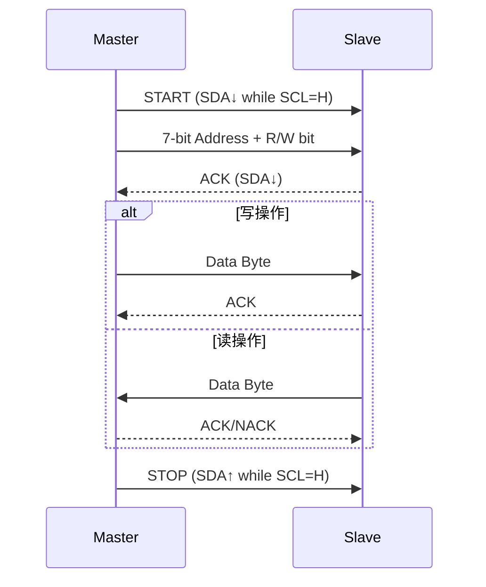

# 第十七章 I2C介绍及应用

## 1. I2C 简介

I2C（Inter-Integrated Circuit，内部集成电路总线）是 STM32H750VBT6 中用于**连接低速外围设备**的同步串行通信接口，由飞利浦（NXP）开发，采用 **两线制** 设计：

- **SDA**：串行数据线（Serial Data）
- **SCL**：串行时钟线（Serial Clock）

I2C 支持 **多主多从架构**、**7 位/10 位地址寻址**、**上拉电阻电平匹配**，广泛应用于连接 **EEPROM、温度传感器、RTC、OLED 显示屏、音频编解码器** 等外设，是嵌入式系统中最常用的低速通信总线之一。

> 🔍 **核心定位**：
> 
> - **I2C ≠ UART/SPI**，而是**共享总线型、地址可寻的“局域网”**
> 
> - 最高通信速率：
>   
>   - **标准模式**：100 kbps
>   - **快速模式**：400 kbps
>   - **快速模式+**：1 Mbps（STM32H7 支持）
> 
> - 支持 **DMA 传输**、**超时检测**、**SMBus/PMBus 兼容**
> 
> - 可配置为 **主模式**（Master）或 **从模式**（Slave）

---

### **1.1 I2C 核心特性（STM32H750VBT6）**

| **特性**          | **参数**                  | **说明**              | **应用场景**  |
| --------------- | ----------------------- | ------------------- | --------- |
| **通信速率**        | 最高 **1 Mbps**（快速模式+）    | 支持时钟动态调节            | 高速传感器     |
| **地址模式**        | 7-bit / 10-bit          | 兼容大多数 I2C 设备        | 多设备挂载     |
| **数据方向**        | 发送 / 接收                 | 支持读写切换              | EEPROM 读写 |
| **DMA 支持**      | ✅（TX/RX）                | 零 CPU 开销传输          | 大数据块传输    |
| **超时机制**        | BUSTIMEOUT              | 防止总线死锁              | 增强系统可靠性   |
| **SMBus/PMBus** | ✅                       | 支持协议级控制             | 电源管理、电池监控 |
| **多 I2C 实例**    | **I2C1、I2C2、I2C3、I2C4** | 可独立配置为主/从           | 多设备系统     |
| **时钟源**         | APB1（100 MHz）           | 通过 `PRESC` 分频生成 SCL | 精确波特率控制   |

📌 **STM32H750VBT6 专属优势**：

- **支持时钟延展（Clock Stretching）**：从设备可拉低 SCL 要求延时
- **硬件 CRC 生成**：SMBus 模式下自动生成 PEC 校验
- **双地址模式**：可响应两个从地址（`OAR2`）
- **噪声滤波**：可配置数字滤波器抑制毛刺
- **与 RTC/ADC 协同**：可用于传感器数据采集系统

---

### 1.2 I2C 工作原理详解

#### 1.2.1 通信协议时序



- **关键信号定义**：
  
  - **START**：SDA 从高到低，SCL 为高
  - **STOP**：SDA 从低到高，SCL 为高
  - **ACK**：第 9 个时钟周期，SDA 被拉低
  - **NACK**：SDA 保持高电平

- **7-bit 地址格式**：
  
  ```c
  [ D7 D6 D5 D4 D3 D2 D1 | R/W ]
        地址 (7-bit)     | 0=Write, 1=Read
  ```

#### 1.2.2 通信模式

| **模式**  | **说明**       | **典型应用**       |
| ------- | ------------ | -------------- |
| **主发送** | MCU 发送数据到从设备 | 写 EEPROM、配置寄存器 |
| **主接收** | MCU 从从设备读取数据 | 读传感器数据         |
| **从发送** | MCU 作为从设备发送  | 多主通信、桥接器       |
| **从接收** | MCU 接收主设备数据  | 命令接收、配置更新      |

#### 1.2.3 波特率生成

- **I2C 波特率由 `TIMINGR` 寄存器控制**，计算复杂：
  
  - 包含 **SCL 高/低电平时间**、**数据建立/保持时间**

- **公式**（简化）：
  
  

- **推荐使用 STM32CubeMX 自动生成 TIMINGR 值**

---

### 1.3 关键寄存器操作

#### 1.3.1 I2C 主要寄存器

| **寄存器**     | **关键位域**                                                | **功能**      | **说明**        |
| ----------- | ------------------------------------------------------- | ----------- | ------------- |
| **CR1**     | PE, TXIE, RXIE, NACKIE, GCEN, SBC                       | 使能、中断控制     | `PE=1` 启用 I2C |
| **CR2**     | SADD[9:0], RD_WRN, NBYTES, RELOAD, START, STOP, AUTOEND | 目标地址、方向、数据量 | 写此寄存器触发传输     |
| **TIMINGR** | PRESC, SCLL, SCLH, SDADEL, SCLDEL                       | 时序配置        | 决定波特率         |
| **ISR**     | TXIS, RXNE, TC, TCR, BERR, ARLO                         | 状态标志        | 必须在 ISR 中读取   |
| **TXDR**    | TXDATA[7:0]                                             | 发送数据寄存器     | 写入即启动发送       |
| **RXDR**    | RXDATA[7:0]                                             | 接收数据寄存器     | 只读            |
| **ICR**     | BERRCF, ARLOCF                                          | 清除错误标志      | 写 1 清除        |

#### 1.3.2 配置步骤（I2C1 主模式，400 kbps）

```c
// 1. 使能 I2C1 时钟和 GPIO 时钟
RCC->APB1LENR |= RCC_APB1LENR_I2C1EN;
RCC->AHB4ENR  |= RCC_AHB4ENR_GPIOBEN;

// 2. 配置 PB6= SCL, PB7= SDA 为开漏复用
GPIOB->MODER   |= GPIO_MODER_MODER6_1 | GPIO_MODER_MODER7_1;
GPIOB->OTYPER  |= GPIO_OTYPER_OT6 | GPIO_OTYPER_OT7; // 开漏
GPIOB->OSPEEDR |= GPIO_OSPEEDER_OSPEED6 | GPIO_OSPEEDER_OSPEED7; // 高速
GPIOB->PUPDR   |= GPIO_PUPDR_PUPD6_0 | GPIO_PUPDR_PUPD7_0; // 上拉
GPIOB->AFR[0]  |= 4 << 24 | 4 << 28; // PB6/PB7 = AF4 (I2C1)

// 3. 配置 TIMINGR（400 kbps，PCLK1=100MHz）
I2C1->TIMINGR = 
      (1 << 28)  // PRESC = 1
    | (0x13 << 20) // SCLDEL = 19
    | (0x10 << 16) // SDADEL = 16
    | (0x3 << 8)   // SCLH = 3
    | (0x9 << 0);  // SCLL = 9

// 4. 使能 I2C
I2C1->CR1 |= I2C_CR1_PE;
```

#### 1.3.3 HAL 库简化操作

```c
I2C_HandleTypeDef hi2c1;

hi2c1.Instance = I2C1;
hi2c1.Init.Timing = 0x10707DBC; // 400 kHz（由 CubeMX 生成）
hi2c1.Init.OwnAddress1 = 0;
hi2c1.Init.AddressingMode = I2C_ADDRESSINGMODE_7BIT;
hi2c1.Init.DualAddressMode = I2C_DUALADDRESS_DISABLE;
hi2c1.Init.OwnAddress2 = 0;
hi2c1.Init.GeneralCallMode = I2C_GENERALCALL_DISABLE;
hi2c1.Init.NoStretchMode = I2C_NOSTRETCH_DISABLE;

HAL_I2C_Init(&hi2c1);
```

### 1.4 I2C vs SPI vs UART 对比

| **特性**    | **I2C**     | **SPI**   | **UART**  |
| --------- | ----------- | --------- | --------- |
| **线数**    | 2           | 3–4（CS可多） | 2         |
| **速率**    | 1 Mbps（max） | 10+ Mbps  | 1–10 Mbps |
| **寻址**    | ✅（7/10-bit） | ❌（靠CS）    | ❌         |
| **主从数量**  | 多主多从        | 单主多从      | 点对点       |
| **硬件复杂度** | 低           | 中         | 低         |
| **抗干扰能力** | 中           | 低         | 中         |
| **典型应用**  | 传感器、EEPROM  | Flash、SD卡 | 调试、GPS    |

> 💡 **选型建议**：
> 
> - **多设备、低速** → I2C
> - **高速、大数据** → SPI
> - **点对点、调试** → UART

## 2. I2C使用示例-STM32IDE

### 2.1 STM32Cube配置


### 2.2 用户代码

```c
#include "i2c.h"
#include "delay.h"

/**
 * @brief       初始化IIC
 * @param       无
 * @retval      无
 */
void iic_init(void)
{
    GPIO_InitTypeDef gpio_init_struct;

    IIC_SCL_GPIO_CLK_ENABLE();  /* SCL引脚时钟使能 */
    IIC_SDA_GPIO_CLK_ENABLE();  /* SDA引脚时钟使能 */

    gpio_init_struct.Pin = IIC_SCL_GPIO_PIN;
    gpio_init_struct.Mode = GPIO_MODE_OUTPUT_PP;        /* 推挽输出 */
    gpio_init_struct.Pull = GPIO_PULLUP;                /* 上拉 */
    gpio_init_struct.Speed = GPIO_SPEED_FREQ_VERY_HIGH; /* 快速 */
    HAL_GPIO_Init(IIC_SCL_GPIO_PORT, &gpio_init_struct);/* SCL */

    gpio_init_struct.Pin = IIC_SDA_GPIO_PIN;
    gpio_init_struct.Mode = GPIO_MODE_OUTPUT_OD;        /* 推挽输出 */
    HAL_GPIO_Init(IIC_SDA_GPIO_PORT, &gpio_init_struct);/* SDA */
    /* SDA引脚模式设置,开漏输出,上拉, 这样就不用再设置IO方向了, 开漏输出的时候(=1), 也可以读取外部信号的高低电平 */

    iic_stop();     /* 停止总线上所有设备 */
}

/**
 * @brief       IIC延时函数,用于控制IIC读写速度
 * @param       无
 * @retval      无
 */
static void iic_delay(void)
{
   delay_us(2);    /* 2us的延时, 读写速度在250Khz以内 */
}

/**
 * @brief       产生IIC起始信号
 * @param       无
 * @retval      无
 */
void iic_start(void)
{
    IIC_SDA(1);
    IIC_SCL(1);
    iic_delay();
    IIC_SDA(0);     /* START信号: 当SCL为高时, SDA从高变成低, 表示起始信号 */
    iic_delay();
    IIC_SCL(0);     /* 钳住I2C总线，准备发送或接收数据 */
    iic_delay();
}

/**
 * @brief       产生IIC停止信号
 * @param       无
 * @retval      无
 */
void iic_stop(void)
{
    IIC_SDA(0);     /* STOP信号: 当SCL为高时, SDA从低变成高, 表示停止信号 */
    iic_delay();
    IIC_SCL(1);
    iic_delay();
    IIC_SDA(1);     /* 发送I2C总线结束信号 */
    iic_delay();
}

/**
 * @brief       等待应答信号到来
 * @param       无
 * @retval      1，接收应答失败
 *              0，接收应答成功
 */
uint8_t iic_wait_ack(void)
{
    uint8_t waittime = 0;
    uint8_t rack = 0;

    IIC_SDA(1);     /* 主机释放SDA线(此时外部器件可以拉低SDA线) */
    iic_delay();
    IIC_SCL(1);     /* SCL=1, 此时从机可以返回ACK */
    iic_delay();

    while (IIC_READ_SDA)    /* 等待应答 */
    {
        waittime++;

        if (waittime > 250)
        {
            iic_stop();
            rack = 1;
            break;
        }
    }

    IIC_SCL(0);     /* SCL=0, 结束ACK检查 */
    iic_delay();
    return rack;
}

/**
 * @brief       产生ACK应答
 * @param       无
 * @retval      无
 */
void iic_ack(void)
{
    IIC_SDA(0);     /* SCL 0 -> 1  时 SDA = 0,表示应答 */
    iic_delay();
    IIC_SCL(1);     /* 产生一个时钟 */
    iic_delay();
    IIC_SCL(0);
    iic_delay();
    IIC_SDA(1);     /* 主机释放SDA线 */
    iic_delay();
}

/**
 * @brief       不产生ACK应答
 * @param       无
 * @retval      无
 */
void iic_nack(void)
{
    IIC_SDA(1);     /* SCL 0 -> 1  时 SDA = 1,表示不应答 */
    iic_delay();
    IIC_SCL(1);     /* 产生一个时钟 */
    iic_delay();
    IIC_SCL(0);
    iic_delay();
}

/**
 * @brief       IIC发送一个字节
 * @param       data: 要发送的数据
 * @retval      无
 */
void iic_send_byte(uint8_t data)
{
    uint8_t t;

    for (t = 0; t < 8; t++)
    {
        IIC_SDA((data & 0x80) >> 7);    /* 高位先发送 */
        iic_delay();
        IIC_SCL(1);
        iic_delay();
        IIC_SCL(0);
        data <<= 1;     /* 左移1位,用于下一次发送 */
    }
    IIC_SDA(1);         /* 发送完成, 主机释放SDA线 */
}

/**
 * @brief       IIC读取一个字节
 * @param       ack:  ack=1时，发送ack; ack=0时，发送nack
 * @retval      接收到的数据
 */
uint8_t iic_read_byte(uint8_t ack)
{
    uint8_t i, receive = 0;

    for (i = 0; i < 8; i++ )    /* 接收1个字节数据 */
    {
        receive <<= 1;  /* 高位先输出,所以先收到的数据位要左移 */
        IIC_SCL(1);
        iic_delay();

        if (IIC_READ_SDA)
        {
            receive++;
        }

        IIC_SCL(0);
        iic_delay();
    }

    if (!ack)
    {
        iic_nack();     /* 发送nACK */
    }
    else
    {
        iic_ack();      /* 发送ACK */
    }

    return receive;
}


```

```c
#include "i2c.h"
#include "eeprom.h"
#include "delay.h"

/**
 * @brief       初始化IIC接口
 * @param       无
 * @retval      无
 */
void at24cxx_init(void)
{
    iic_init();
}

/**
 * @brief       在AT24CXX指定地址读出一个数据
 * @param       readaddr: 开始读数的地址
 * @retval      读到的数据
 */
uint8_t at24cxx_read_one_byte(uint16_t addr)
{
    uint8_t temp = 0;
    iic_start();                /* 发送起始信号 */

    /* 根据不同的24CXX型号, 发送高位地址
     * 1, 24C16以上的型号, 分2个字节发送地址
     * 2, 24C16及以下的型号, 分1个低字节地址 + 占用器件地址的bit1~bit3位 用于表示高位地址, 最多11位地址
     *    对于24C01/02, 其器件地址格式(8bit)为: 1  0  1  0  A2  A1  A0  R/W
     *    对于24C04,    其器件地址格式(8bit)为: 1  0  1  0  A2  A1  a8  R/W
     *    对于24C08,    其器件地址格式(8bit)为: 1  0  1  0  A2  a9  a8  R/W
     *    对于24C16,    其器件地址格式(8bit)为: 1  0  1  0  a10 a9  a8  R/W
     *    R/W      : 读/写控制位 0,表示写; 1,表示读;
     *    A0/A1/A2 : 对应器件的1,2,3引脚(只有24C01/02/04/8有这些脚)
     *    a8/a9/a10: 对应存储整列的高位地址, 11bit地址最多可以表示2048个位置,可以寻址24C16及以内的型号
     */
    if (EE_TYPE > AT24C16)      /* 24C16以上的型号, 分2个字节发送地址 */
    {
        iic_send_byte(0XA0);    /* 发送写命令, IIC规定最低位是0, 表示写入 */
        iic_wait_ack();         /* 每次发送完一个字节,都要等待ACK */
        iic_send_byte(addr >> 8);/* 发送高字节地址 */
    }
    else
    {
        iic_send_byte(0XA0 + ((addr >> 8) << 1));   /* 发送器件 0XA0 + 高位a8/a9/a10地址,写数据 */
    }

    iic_wait_ack();             /* 每次发送完一个字节,都要等待ACK */
    iic_send_byte(addr % 256);  /* 发送低位地址 */
    iic_wait_ack();             /* 等待ACK, 此时地址发送完成了 */

    iic_start();                /* 重新发送起始信号 */
    iic_send_byte(0XA1);        /* 进入接收模式, IIC规定最低位是0, 表示读取 */
    iic_wait_ack();             /* 每次发送完一个字节,都要等待ACK */
    temp = iic_read_byte(0);    /* 接收一个字节数据 */
    iic_stop();                 /* 产生一个停止条件 */
    return temp;
}

/**
 * @brief       在AT24CXX指定地址写入一个数据
 * @param       addr: 写入数据的目的地址
 * @param       data: 要写入的数据
 * @retval      无
 */
void at24cxx_write_one_byte(uint16_t addr, uint8_t data)
{
    /* 原理说明见:at24cxx_read_one_byte函数, 本函数完全类似 */
    iic_start();                /* 发送起始信号 */

    if (EE_TYPE > AT24C16)      /* 24C16以上的型号, 分2个字节发送地址 */
    {
        iic_send_byte(0XA0);    /* 发送写命令, IIC规定最低位是0, 表示写入 */
        iic_wait_ack();         /* 每次发送完一个字节,都要等待ACK */
        iic_send_byte(addr >> 8);/* 发送高字节地址 */
    }
    else
    {
        iic_send_byte(0XA0 + ((addr >> 8) << 1));   /* 发送器件 0XA0 + 高位a8/a9/a10地址,写数据 */
    }

    iic_wait_ack();             /* 每次发送完一个字节,都要等待ACK */
    iic_send_byte(addr % 256);  /* 发送低位地址 */
    iic_wait_ack();             /* 等待ACK, 此时地址发送完成了 */

    /* 因为写数据的时候,不需要进入接收模式了,所以这里不用重新发送起始信号了 */
    iic_send_byte(data);        /* 发送1字节 */
    iic_wait_ack();             /* 等待ACK */
    iic_stop();                 /* 产生一个停止条件 */
    delay_ms(10);               /* 注意: EEPROM 写入比较慢,必须等到10ms后再写下一个字节 */
}

/**
 * @brief       检查AT24CXX是否正常
 *   @note      检测原理: 在器件的末地址写如0X55, 然后再读取, 如果读取值为0X55
 *              则表示检测正常. 否则,则表示检测失败.
 *
 * @param       无
 * @retval      检测结果
 *              0: 检测成功
 *              1: 检测失败
 */
uint8_t at24cxx_check(void)
{
    uint8_t temp;
    uint16_t addr = EE_TYPE;
    temp = at24cxx_read_one_byte(addr); /* 避免每次开机都写AT24CXX */

    if (temp == 0X55)   /* 读取数据正常 */
    {
        return 0;
    }
    else    /* 排除第一次初始化的情况 */
    {
        at24cxx_write_one_byte(addr, 0X55); /* 先写入数据 */
        temp = at24cxx_read_one_byte(255);  /* 再读取数据 */

        if (temp == 0X55)return 0;
    }

    return 1;
}

/**
 * @brief       在AT24CXX里面的指定地址开始读出指定个数的数据
 * @param       addr    : 开始读出的地址 对24c02为0~255
 * @param       pbuf    : 数据数组首地址
 * @param       datalen : 要读出数据的个数
 * @retval      无
 */
void at24cxx_read(uint16_t addr, uint8_t *pbuf, uint16_t datalen)
{
    while (datalen--)
    {
        *pbuf++ = at24cxx_read_one_byte(addr++);
    }
}

/**
 * @brief       在AT24CXX里面的指定地址开始写入指定个数的数据
 * @param       addr    : 开始写入的地址 对24c02为0~255
 * @param       pbuf    : 数据数组首地址
 * @param       datalen : 要写入数据的个数
 * @retval      无
 */
void at24cxx_write(uint16_t addr, uint8_t *pbuf, uint16_t datalen)
{
    while (datalen--)
    {
        at24cxx_write_one_byte(addr, *pbuf);
        addr++;
        pbuf++;
    }
}


```

```c
#include "main.h"
#include "eeprom.h"
#include "bsp_init.h"
#include "stdio.h" // For printf function
#include "string.h"

void SystemClock_Config(void);
void PeriphCommonClock_Config(void);
static void MPU_Config(void);

// 要写入的字符串
const uint8_t text_buf[] = {"STM32 I2C"};
#define text_size sizeof(text_buf)

int main(void)
{
  uint8_t key_value;
  uint8_t temp_data[text_size];
  MPU_Config();
  HAL_Init();
  SystemClock_Config();
  PeriphCommonClock_Config();
  bsp_init();
  at24cxx_init();
  while(at24cxx_check()) // 监测不到24c02
  {
    HAL_GPIO_TogglePin(LED_RED_Port, LED_RED_Pin);
  }
  printf("24C02 Ready!!!\r\n");
  while (1)
  {
    key_value = key_scan(0);
    if(key_value == KEY0_PRES) // 写入数据
    {
      printf("Start Write 24C02....\r\n");
      fflush(stdout);
      at24cxx_write(0, (uint8_t*)text_buf, text_size);
      HAL_Delay(5); // 确保写入完成

      // 验证写入的数据
      uint8_t verify_data[text_size];
      at24cxx_read(0, verify_data, text_size);
      if(memcmp(text_buf, verify_data, text_size) == 0) {
        printf("24C02 Write Verified OK!\r\n");
      } else {
        printf("24C02 Write Verification Failed!\r\n");
      }
      fflush(stdout);
      HAL_GPIO_WritePin(LED_GREEN_Port, LED_GREEN_Pin, RESET);
    }
    if(key_value == KEY1_PRES) // 读取数据
    {
      printf("Start Read 24C02....\r\n");
      at24cxx_read(0, temp_data, text_size);
      printf("The Data Readed Is:  %s", (char*)temp_data);
    }
    HAL_Delay(10);
  }
}

/**
  * @brief System Clock Configuration
  * @retval None
  */
void SystemClock_Config(void)
{
  RCC_OscInitTypeDef RCC_OscInitStruct = {0};
  RCC_ClkInitTypeDef RCC_ClkInitStruct = {0};

  /** Supply configuration update enable
  */
  HAL_PWREx_ConfigSupply(PWR_LDO_SUPPLY);

  /** Configure the main internal regulator output voltage
  */
  __HAL_PWR_VOLTAGESCALING_CONFIG(PWR_REGULATOR_VOLTAGE_SCALE0);

  while(!__HAL_PWR_GET_FLAG(PWR_FLAG_VOSRDY)) {}

  /** Initializes the RCC Oscillators according to the specified parameters
  * in the RCC_OscInitTypeDef structure.
  */
  RCC_OscInitStruct.OscillatorType = RCC_OSCILLATORTYPE_HSI|RCC_OSCILLATORTYPE_LSI
                              |RCC_OSCILLATORTYPE_HSE;
  RCC_OscInitStruct.HSEState = RCC_HSE_ON;
  RCC_OscInitStruct.HSIState = RCC_HSI_DIV1;
  RCC_OscInitStruct.HSICalibrationValue = RCC_HSICALIBRATION_DEFAULT;
  RCC_OscInitStruct.LSIState = RCC_LSI_ON;
  RCC_OscInitStruct.PLL.PLLState = RCC_PLL_ON;
  RCC_OscInitStruct.PLL.PLLSource = RCC_PLLSOURCE_HSE;
  RCC_OscInitStruct.PLL.PLLM = 2;
  RCC_OscInitStruct.PLL.PLLN = 240;
  RCC_OscInitStruct.PLL.PLLP = 2;
  RCC_OscInitStruct.PLL.PLLQ = 2;
  RCC_OscInitStruct.PLL.PLLR = 2;
  RCC_OscInitStruct.PLL.PLLRGE = RCC_PLL1VCIRANGE_2;
  RCC_OscInitStruct.PLL.PLLVCOSEL = RCC_PLL1VCOWIDE;
  RCC_OscInitStruct.PLL.PLLFRACN = 0;
  if (HAL_RCC_OscConfig(&RCC_OscInitStruct) != HAL_OK)
  {
    Error_Handler();
  }

  /** Initializes the CPU, AHB and APB buses clocks
  */
  RCC_ClkInitStruct.ClockType = RCC_CLOCKTYPE_HCLK|RCC_CLOCKTYPE_SYSCLK
                              |RCC_CLOCKTYPE_PCLK1|RCC_CLOCKTYPE_PCLK2
                              |RCC_CLOCKTYPE_D3PCLK1|RCC_CLOCKTYPE_D1PCLK1;
  RCC_ClkInitStruct.SYSCLKSource = RCC_SYSCLKSOURCE_PLLCLK;
  RCC_ClkInitStruct.SYSCLKDivider = RCC_SYSCLK_DIV1;
  RCC_ClkInitStruct.AHBCLKDivider = RCC_HCLK_DIV2;
  RCC_ClkInitStruct.APB3CLKDivider = RCC_APB3_DIV2;
  RCC_ClkInitStruct.APB1CLKDivider = RCC_APB1_DIV2;
  RCC_ClkInitStruct.APB2CLKDivider = RCC_APB2_DIV2;
  RCC_ClkInitStruct.APB4CLKDivider = RCC_APB4_DIV2;

  if (HAL_RCC_ClockConfig(&RCC_ClkInitStruct, FLASH_LATENCY_4) != HAL_OK)
  {
    Error_Handler();
  }
}

/**
  * @brief Peripherals Common Clock Configuration
  * @retval None
  */
void PeriphCommonClock_Config(void)
{
  RCC_PeriphCLKInitTypeDef PeriphClkInitStruct = {0};

  /** Initializes the peripherals clock
  */
  PeriphClkInitStruct.PeriphClockSelection = RCC_PERIPHCLK_CKPER;
  PeriphClkInitStruct.CkperClockSelection = RCC_CLKPSOURCE_HSI;
  if (HAL_RCCEx_PeriphCLKConfig(&PeriphClkInitStruct) != HAL_OK)
  {
    Error_Handler();
  }
}

/* USER CODE BEGIN 4 */

/* USER CODE END 4 */

 /* MPU Configuration */

void MPU_Config(void)
{
  MPU_Region_InitTypeDef MPU_InitStruct = {0};

  /* Disables the MPU */
  HAL_MPU_Disable();

  /** Initializes and configures the Region and the memory to be protected
  */
  MPU_InitStruct.Enable = MPU_REGION_ENABLE;
  MPU_InitStruct.Number = MPU_REGION_NUMBER0;
  MPU_InitStruct.BaseAddress = 0x0;
  MPU_InitStruct.Size = MPU_REGION_SIZE_4GB;
  MPU_InitStruct.SubRegionDisable = 0x87;
  MPU_InitStruct.TypeExtField = MPU_TEX_LEVEL0;
  MPU_InitStruct.AccessPermission = MPU_REGION_NO_ACCESS;
  MPU_InitStruct.DisableExec = MPU_INSTRUCTION_ACCESS_DISABLE;
  MPU_InitStruct.IsShareable = MPU_ACCESS_SHAREABLE;
  MPU_InitStruct.IsCacheable = MPU_ACCESS_NOT_CACHEABLE;
  MPU_InitStruct.IsBufferable = MPU_ACCESS_NOT_BUFFERABLE;

  HAL_MPU_ConfigRegion(&MPU_InitStruct);
  /* Enables the MPU */
  HAL_MPU_Enable(MPU_PRIVILEGED_DEFAULT);

}

/**
  * @brief  This function is executed in case of error occurrence.
  * @retval None
  */
void Error_Handler(void)
{
  /* USER CODE BEGIN Error_Handler_Debug */
  /* User can add his own implementation to report the HAL error return state */
  __disable_irq();
  while (1)
  {
  }
  /* USER CODE END Error_Handler_Debug */
}
#ifdef USE_FULL_ASSERT
/**
  * @brief  Reports the name of the source file and the source line number
  *         where the assert_param error has occurred.
  * @param  file: pointer to the source file name
  * @param  line: assert_param error line source number
  * @retval None
  */
void assert_failed(uint8_t *file, uint32_t line)
{
  /* USER CODE BEGIN 6 */
  /* User can add his own implementation to report the file name and line number,
     ex: printf("Wrong parameters value: file %s on line %d\r\n", file, line) */
  /* USER CODE END 6 */
}
#endif /* USE_FULL_ASSERT */

```

## 3. I2C相关函数总结（HAL库）

### 3.1 初始化与配置

- **核心配置流程**（五步关键操作）：
  
  1. **使能时钟**（I2C + GPIO）
  2. **配置GPIO复用功能**（SCL/SDA）
  3. **初始化I2C参数**（时钟/寻址模式等）
  4. **启动I2C外设**
  5. **配置NVIC中断**（若使用中断模式）

- `HAL_I2C_Init(I2C_HandleTypeDef *hi2c)`  
  **基础配置示例**（I2C1 100kHz标准模式）：
  
  ```c
  // 1. 使能I2C和GPIO时钟
  __HAL_RCC_I2C1_CLK_ENABLE();
  __HAL_RCC_GPIOB_CLK_ENABLE();
  
  // 2. 配置GPIO（PB6=SCL, PB7=SDA）
  GPIO_InitTypeDef GPIO_InitStruct = {0};
  GPIO_InitStruct.Pin = GPIO_PIN_6 | GPIO_PIN_7;
  GPIO_InitStruct.Mode = GPIO_MODE_AF_OD;           // 开漏输出
  GPIO_InitStruct.Pull = GPIO_PULLUP;               // 上拉电阻
  GPIO_InitStruct.Speed = GPIO_SPEED_FREQ_VERY_HIGH;
  GPIO_InitStruct.Alternate = GPIO_AF4_I2C1;        // 复用功能
  HAL_GPIO_Init(GPIOB, &GPIO_InitStruct);
  
  // 3. 配置I2C参数
  hi2c1.Instance = I2C1;
  hi2c1.Init.Timing = 0x10805E89;                   // 100kHz时序
  hi2c1.Init.OwnAddress1 = 0x00;                    // 无自身地址
  hi2c1.Init.AddressingMode = I2C_ADDRESSINGMODE_7BIT; // 7位寻址
  hi2c1.Init.DualAddressMode = I2C_DUALADDRESS_DISABLE; // 禁用双地址
  hi2c1.Init.OwnAddress2 = 0x00;
  hi2c1.Init.OwnAddress2Masks = I2C_OA2_NOMASK;
  hi2c1.Init.GeneralCallMode = I2C_GENERALCALL_DISABLE; // 禁用广播
  hi2c1.Init.NoStretchMode = I2C_NOSTRETCH_DISABLE;     // 启用时钟延展
  HAL_I2C_Init(&hi2c1);
  ```

- **`I2C_InitTypeDef` 结构体成员说明**：
  
  | **成员**            | **说明** | **关键选项**            | **H750特殊说明** |
  | ----------------- | ------ | ------------------- | ------------ |
  | `Timing`          | 时序配置   | 32位配置值              | 需精确计算        |
  | `AddressingMode`  | 寻址模式   | `7BIT`, `10BIT`     | 7位最常用        |
  | `DualAddressMode` | 双地址    | `ENABLE`, `DISABLE` | 从机模式用        |
  | `GeneralCallMode` | 广播模式   | `ENABLE`, `DISABLE` | 从机响应0x00     |
  | `NoStretchMode`   | 时钟延展   | `ENABLE`, `DISABLE` | 影响从机兼容性      |

- **时序参数计算**（核心！）：
  
  - **必须使用STM32CubeMX**生成精确`Timing`值
  
  - **关键参数**：
    
    | **模式**   | **SCL频率** | **典型Timing值** | **H750时钟**   |
    | -------- | --------- | ------------- | ------------ |
    | Standard | 100kHz    | `0x10805E89`  | PCLK1=100MHz |
    | Fast     | 400kHz    | `0x00702991`  | PCLK1=100MHz |
    | Fast+    | 1MHz      | `0x00300B29`  | PCLK1=100MHz |

- **GPIO配置要点**：
  
  ```c
  // I2C引脚必须配置为开漏+上拉
  GPIO_InitStruct.Mode = GPIO_MODE_AF_OD;      // 开漏模式
  GPIO_InitStruct.Pull = GPIO_PULLUP;          // 外部或内部上拉
  GPIO_InitStruct.Speed = GPIO_SPEED_FREQ_VERY_HIGH;
  GPIO_InitStruct.Alternate = GPIO_AF4_I2C1;   // 复用功能选择
  ```

### 3.2 I2C操作核心函数

- **主模式操作**：
  
  | **函数**                          | **原型**                               | **特点** | **应用场景** |
  | ------------------------------- | ------------------------------------ | ------ | -------- |
  | `HAL_I2C_Master_Transmit()`     | `(hi2c, Addr, *Data, Size, Timeout)` | 阻塞式发送  | 短数据发送    |
  | `HAL_I2C_Master_Receive()`      | `(hi2c, Addr, *Data, Size, Timeout)` | 阻塞式接收  | 读取传感器    |
  | `HAL_I2C_Master_Transmit_IT()`  | `(hi2c, Addr, *Data, Size)`          | 中断发送   | 非阻塞      |
  | `HAL_I2C_Master_Receive_IT()`   | `(hi2c, Addr, *Data, Size)`          | 中断接收   |          |
  | `HAL_I2C_Master_Transmit_DMA()` | `(hi2c, Addr, *Data, Size)`          | DMA发送  | 大数据量     |
  | `HAL_I2C_Master_Receive_DMA()`  | `(hi2c, Addr, *Data, Size)`          | DMA接收  |          |

- **从模式操作**：
  
  ```c
  // 配置自身地址
  hi2c1.Init.OwnAddress1 = 0x30;
  hi2c1.Init.AddressingMode = I2C_ADDRESSINGMODE_7BIT;
  HAL_I2C_Init(&hi2c1);
  
  // 启动从机接收（中断模式）
  HAL_I2C_Slave_Receive_IT(&hi2c1, rx_buffer, BUFFER_SIZE);
  
  // 启动从机发送
  HAL_I2C_Slave_Transmit_IT(&hi2c1, tx_buffer, BUFFER_SIZE);
  ```

- **复合操作（读写寄存器）**：
  
  ```c
  // 写寄存器地址+数据
  uint8_t data[2] = {REGISTER_ADDR, DATA_VALUE};
  HAL_I2C_Master_Transmit(&hi2c1, SLAVE_ADDR<<1, data, 2, 100);
  
  // 读寄存器（带停止和重新开始）
  HAL_I2C_Master_Transmit(&hi2c1, SLAVE_ADDR<<1, &reg_addr, 1, 100);
  HAL_I2C_Master_Receive(&hi2c1, (SLAVE_ADDR<<1)|0x01, &read_data, 1, 100);
  
  // 或使用复合函数
  HAL_I2C_Mem_Write(&hi2c1, SLAVE_ADDR<<1, REG_ADDR, I2C_MEMADD_SIZE_8BIT, &data, 1, 100);
  HAL_I2C_Mem_Read(&hi2c1, SLAVE_ADDR<<1, REG_ADDR, I2C_MEMADD_SIZE_8BIT, &data, 1, 100);
  ```

- **状态检查**：
  
  ```c
  // 检查总线是否空闲
  if (HAL_I2C_GetState(&hi2c1) == HAL_I2C_STATE_READY) {
      // 可以开始新传输
  }
  
  // 检查错误
  if (HAL_I2C_GetError(&hi2c1) & HAL_I2C_ERROR_AF) {
      // 应答错误
  }
  ```

### 3.3 高级功能与特性

- **DMA模式传输**：
  
  ```c
  // 启用DMA传输
  __HAL_LINKDMA(&hi2c1, hdmatx, hdma_i2c1_tx);
  __HAL_LINKDMA(&hi2c1, hdmarx, hdma_i2c1_rx);
  
  // DMA传输（非阻塞）
  HAL_I2C_Master_Transmit_DMA(&hi2c1, SLAVE_ADDR<<1, tx_buffer, BUFFER_SIZE);
  
  // 传输完成回调
  void HAL_I2C_MasterTxCpltCallback(I2C_HandleTypeDef *hi2c)
  {
      if(hi2c == &hi2c1) {
          transmission_complete = 1;
      }
  }
  ```

- **多主系统处理**：
  
  ```c
  // 检测总线冲突
  if (__HAL_I2C_GET_FLAG(&hi2c1, I2C_FLAG_BUSY)) {
      // 总线被占用
      HAL_Delay(1);
      // 重试机制
  }
  ```

- **时钟延展控制**：
  
  ```c
  // 启用时钟延展（从机可拉低SCL）
  hi2c1.Init.NoStretchMode = I2C_NOSTRETCH_DISABLE;
  
  // 禁用时钟延展（提高速度，但兼容性差）
  hi2c1.Init.NoStretchMode = I2C_NOSTRETCH_ENABLE;
  ```

- **SMBus模式**（系统管理总线）：
  
  ```c
  // 启用SMBus功能
  HAL_I2CEx_EnableSMBusAlert(&hi2c1);  // 使能报警
  HAL_I2CEx_ConfigAnalogFilter(&hi2c1, I2C_ANALOGFILTER_ENABLE);
  ```

### 3.4 使用示例（完整流程）

#### 3.4.1 示例1：I2C主模式读写EEPROM

```c
#define EEPROM_ADDR     0x50
#define EEPROM_PAGE_SIZE 32
uint8_t eeprom_buffer[EEPROM_PAGE_SIZE];

// 1. 初始化I2C
void I2C_Init(void)
{
    __HAL_RCC_I2C1_CLK_ENABLE();
    __HAL_RCC_GPIOB_CLK_ENABLE();

    // 配置GPIO (PB8=SCL, PB9=SDA)
    GPIO_InitTypeDef GPIO_InitStruct = {0};
    GPIO_InitStruct.Pin = GPIO_PIN_8 | GPIO_PIN_9;
    GPIO_InitStruct.Mode = GPIO_MODE_AF_OD;
    GPIO_InitStruct.Pull = GPIO_PULLUP;
    GPIO_InitStruct.Speed = GPIO_SPEED_FREQ_VERY_HIGH;
    GPIO_InitStruct.Alternate = GPIO_AF4_I2C1;
    HAL_GPIO_Init(GPIOB, &GPIO_InitStruct);

    // 配置I2C
    hi2c1.Instance = I2C1;
    hi2c1.Init.Timing = 0x10805E89;  // 100kHz
    hi2c1.Init.OwnAddress1 = 0;
    hi2c1.Init.AddressingMode = I2C_ADDRESSINGMODE_7BIT;
    hi2c1.Init.DualAddressMode = I2C_DUALADDRESS_DISABLE;
    hi2c1.Init.OwnAddress2 = 0;
    hi2c1.Init.OwnAddress2Masks = I2C_OA2_NOMASK;
    hi2c1.Init.GeneralCallMode = I2C_GENERALCALL_DISABLE;
    hi2c1.Init.NoStretchMode = I2C_NOSTRETCH_DISABLE;

    HAL_I2C_Init(&hi2c1);
}

// 2. 写EEPROM页
HAL_StatusTypeDef EEPROM_Write_Page(uint8_t page_addr, uint8_t *data, uint8_t size)
{
    uint8_t tx_buffer[EEPROM_PAGE_SIZE + 1];

    // 第1字节为内存地址
    tx_buffer[0] = page_addr * EEPROM_PAGE_SIZE;
    memcpy(&tx_buffer[1], data, size);

    // 发送数据
    return HAL_I2C_Master_Transmit(&hi2c1, 
                                   EEPROM_ADDR << 1, 
                                   tx_buffer, 
                                   size + 1, 
                                   100);
}

// 3. 读EEPROM
HAL_StatusTypeDef EEPROM_Read(uint16_t mem_addr, uint8_t *data, uint8_t size)
{
    // 先发送内存地址
    uint8_t addr_byte = (uint8_t)mem_addr;
    HAL_StatusTypeDef status = HAL_I2C_Master_Transmit(&hi2c1,
                                                       EEPROM_ADDR << 1,
                                                       &addr_byte,
                                                       1,
                                                       100);

    if (status != HAL_OK) return status;

    // 接收数据
    return HAL_I2C_Master_Receive(&hi2c1,
                                  (EEPROM_ADDR << 1) | 0x01,
                                  data,
                                  size,
                                  100);
}

// 4. 使用示例
void EEPROM_Example(void)
{
    I2C_Init();

    // 写数据
    for(int i = 0; i < EEPROM_PAGE_SIZE; i++) {
        eeprom_buffer[i] = i;
    }
    EEPROM_Write_Page(0, eeprom_buffer, EEPROM_PAGE_SIZE);

    // 等待写完成（典型5ms）
    HAL_Delay(10);

    // 读数据
    EEPROM_Read(0, eeprom_buffer, EEPROM_PAGE_SIZE);

    // 验证
    for(int i = 0; i < EEPROM_PAGE_SIZE; i++) {
        if(eeprom_buffer[i] != i) {
            error_handler();
        }
    }
}
```

#### 3.4.2 示例2：I2C从模式实现

```c
#define SLAVE_ADDR      0x30
#define RX_BUFFER_SIZE  64
uint8_t slave_rx_buffer[RX_BUFFER_SIZE];
uint8_t slave_tx_buffer[RX_BUFFER_SIZE] = "Hello Master!";
volatile uint8_t slave_ready = 0;

// 1. 配置从机
void I2C_Slave_Init(void)
{
    __HAL_RCC_I2C1_CLK_ENABLE();
    __HAL_RCC_GPIOB_CLK_ENABLE();

    // 配置GPIO (同上)

    // 配置I2C为从机
    hi2c1.Instance = I2C1;
    hi2c1.Init.Timing = 0x10805E89;
    hi2c1.Init.OwnAddress1 = SLAVE_ADDR;
    hi2c1.Init.AddressingMode = I2C_ADDRESSINGMODE_7BIT;
    // 其他参数同主模式
    HAL_I2C_Init(&hi2c1);

    // 配置NVIC
    HAL_NVIC_SetPriority(I2C1_EV_IRQn, 1, 0);
    HAL_NVIC_EnableIRQ(I2C1_EV_IRQn);
    HAL_NVIC_SetPriority(I2C1_ER_IRQn, 1, 0);
    HAL_NVIC_EnableIRQ(I2C1_ER_IRQn);

    // 启动从机接收
    HAL_I2C_Slave_Receive_IT(&hi2c1, slave_rx_buffer, RX_BUFFER_SIZE);
}

// 2. 事件中断服务函数
void I2C1_EV_IRQHandler(void)
{
    HAL_I2C_EV_IRQHandler(&hi2c1);
}

// 3. 错误中断服务函数
void I2C1_ER_IRQHandler(void)
{
    HAL_I2C_ER_IRQHandler(&hi2c1);
}

// 4. 回调函数
void HAL_I2C_SlaveRxCpltCallback(I2C_HandleTypeDef *hi2c)
{
    if(hi2c == &hi2c1) {
        // 接收完成
        slave_ready = 1;

        // 启动下一次接收
        HAL_I2C_Slave_Receive_IT(hi2c, slave_rx_buffer, RX_BUFFER_SIZE);

        // 如果接收到特定命令，准备发送响应
        if(slave_rx_buffer[0] == 0xFF) {
            HAL_I2C_Slave_Transmit_IT(hi2c, slave_tx_buffer, 12);
        }
    }
}

void HAL_I2C_SlaveTxCpltCallback(I2C_HandleTypeDef *hi2c)
{
    if(hi2c == &hi2c1) {
        // 发送完成
        HAL_I2C_Slave_Receive_IT(hi2c, slave_rx_buffer, RX_BUFFER_SIZE);
    }
}
```

## 4. 关键注意事项

1. **上拉电阻选择**：
   
   - **典型值**：4.7kΩ
   
   - **计算公式**：
     
     ```c
     R_pullup > (VDD - VIL) / 3mA
     ```
   
   - **高速模式**：需减小电阻值（如2.2kΩ）

2. **时序参数陷阱**：
   
   - **必须使用CubeMX**生成`Timing`值
   - **手动计算极易出错**
   - **不同PCLK1频率需要不同Timing**

3. **地址格式**：
   
   - **7位地址**：实际传输时左移1位
     
     ```c
     // 7位地址0x50 → 传输0xA0（写）或0xA1（读）
     HAL_I2C_Master_Transmit(&hi2c1, 0x50<<1, data, size, timeout);
     ```
   
   - **10位地址**：使用`I2C_ADDRESSINGMODE_10BIT`

4. **总线锁定处理**：
   
   ```c
    // I2C总线锁定恢复程序
    void I2C_Recovery(void)
    {
        // 9个时钟脉冲
        for(int i = 0; i < 9; i++) {
            HAL_GPIO_WritePin(GPIOB, GPIO_PIN_6, GPIO_PIN_RESET);
            HAL_Delay(1);
            HAL_GPIO_WritePin(GPIOB, GPIO_PIN_6, GPIO_PIN_SET);
            HAL_Delay(1);
        }
   
        // 生成停止条件
        HAL_GPIO_WritePin(GPIOB, GPIO_PIN_7, GPIO_PIN_SET);
        HAL_Delay(1);
        HAL_GPIO_WritePin(GPIOB, GPIO_PIN_6, GPIO_PIN_SET);
        HAL_Delay(1);
    }
   ```

5. **DMA传输陷阱**：
   
   - **必须链接DMA句柄**：
     
     ```c
     __HAL_LINKDMA(&hi2c1, hdmatx, hdma_i2c1_tx);
     ```
   
   - **Cache一致性**：
     
     ```c
     SCB_CleanDCache_by_Addr((uint32_t*)tx_buffer, size);
     SCB_InvalidateDCache_by_Addr((uint32_t*)rx_buffer, size);
     ```

---

### 4.1 H750特有优化技巧

| **场景**    | **解决方案**         | **性能提升** | **实现要点**            |
| --------- | ---------------- | -------- | ------------------- |
| **高速通信**  | 400kHz Fast Mode | 速度×4     | `Timing=0x00702991` |
| **长距离传输** | 增强上拉             | 可靠性↑     | 总线电容<400pF          |
| **多设备系统** | 地址扫描             | 调试方便     | 遍历0x08-0x77         |
| **低功耗**   | STOP模式唤醒         | 功耗↓      | 从机模式响应              |

> **避坑指南**：
> 
> 1. **H750 I2C架构**：
>    
>    - 支持SMBus Alert和PEC校验
>    - 可配置数字滤波器抑制噪声
> 
> 2. **GPIO复用选择**：
>    
>    ```c
>    // I2C1可映射到不同引脚
>    __HAL_RCC_GPIOB_CLK_ENABLE();
>    GPIO_InitStruct.Alternate = GPIO_AF4_I2C1;  // PB6/PB7
>    
>    // 或
>    __HAL_RCC_GPIOC_CLK_ENABLE();
>    GPIO_InitStruct.Alternate = GPIO_AF4_I2C1;  // PC6/PC7
>    ```
> 
> 3. **中断优先级**：
>    
>    - I2C事件中断（EV）优先级 **高于** 错误中断（ER）
>    - 否则错误可能无法及时处理
> 
> 4. **生产环境测试**：
>    
>    - 使用逻辑分析仪验证时序
>    - 测试最坏情况下的总线负载
>    - 验证从机的时钟延展兼容性

---

### 4.2 I2C模式性能对比

| **模式**   | **SCL频率** | **Timing配置** | **典型应用**   |
| -------- | --------- | ------------ | ---------- |
| Standard | 100kHz    | `0x10805E89` | 传感器、EEPROM |
| Fast     | 400kHz    | `0x00702991` | 高速数据采集     |
| Fast+    | 1MHz      | `0x00300B29` | 视频传输       |

> **重要提示**：
> 
> - I2C是**最常用的串行总线**，但时序要求严格
> - 上拉电阻是**可靠通信的关键**
> - 从机模式需要完善的中断处理机制
> - DMA模式可释放CPU资源用于大数据传输

---
