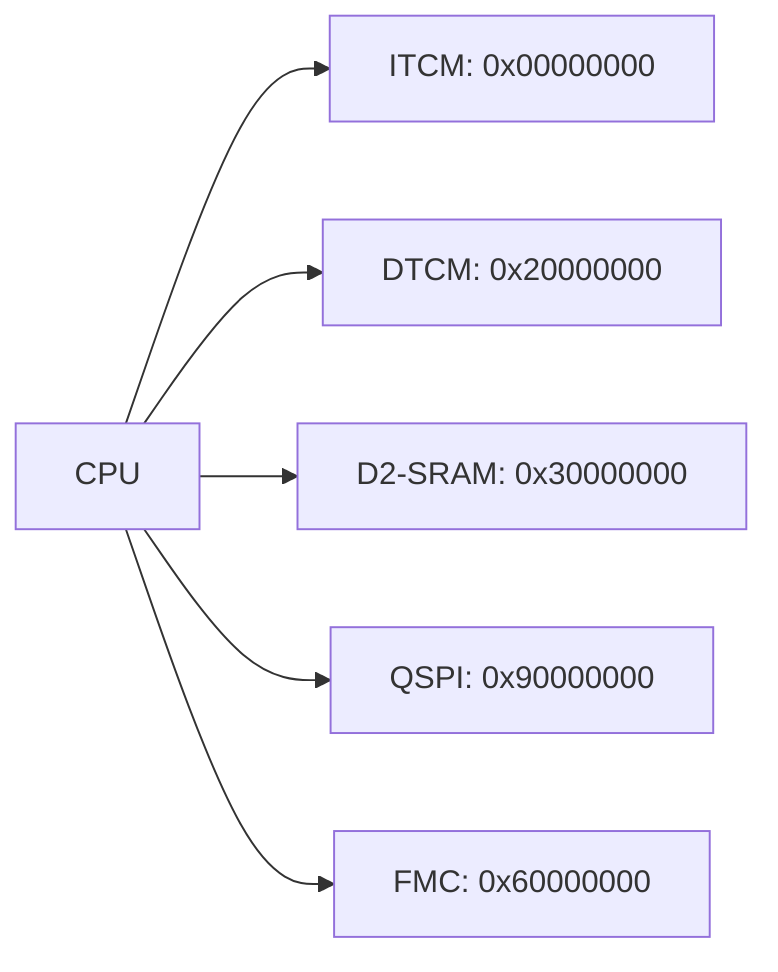

# 第二十章 内存管理介绍及应用

## 1. 内存管理简介

内存管理是 **STM32H750VBT6** 系统中对**片上存储资源进行规划、分配、保护和优化**的核心机制，涉及 **Flash、SRAM、DMA专用内存、缓存（Cache）** 以及 **外部存储（QSPI/FMC）** 的协同使用。良好的内存管理可提升系统性能、增强安全性、降低功耗，并支持复杂应用（如RTOS、图形界面、音频处理）的稳定运行。

> 🔍 **核心定位**：
> 
> - **内存管理 ≠ 简单分配数组**，而是**全系统存储资源的“战略调度”**
> - 涉及 **链接脚本、启动代码、MPU、Cache、DMA、堆栈优化**
> - 是实现 **多任务、实时性、安全性** 的基础
> - 支持 **XIP（代码执行）、零拷贝、内存保护**

---

### 1.1 STM32H750VBT6 内存架构总览

| **内存类型**           | **起始地址**      | **大小**   | **用途**        | **访问速度**      |
| ------------------ | ------------- | -------- | ------------- | ------------- |
| **内部Flash（虚拟）**    | `0x0800 0000` | 128 KB   | 程序代码、常量       | 480 MHz（0 WS） |
| **系统存储区**          | `0x1FF0 9800` | 30 KB    | ST Bootloader | 只读            |
| **OTP 区域**         | `0x1FF0 F400` | 512 B    | 唯一ID、密钥       | 一次性写入         |
| **D1域 SRAM（ITCM）** | `0x0000 0000` | 64 KB    | 高速代码/数据       | CPU 直接访问      |
| **D1域 SRAM（DTCM）** | `0x2000 0000` | 128 KB   | 变量、堆栈         | 与CPU同频        |
| **D2域 SRAM**       | `0x3000 0000` | 512 KB   | 外设缓冲、DMA      | 高带宽           |
| **D3域 SRAM**       | `0x3800 0000` | 32 KB    | 低功耗域数据        | Stop模式可用      |
| **QSPI Flash**     | `0x9000 0000` | 8–128 MB | 大容量代码/资源      | XIP 模式可执行     |
| **FMC PSRAM**      | `0x6000 0000` | 1–8 MB   | 图形缓冲、大数组      | 可变时序          |

📌 **关键特性**：

- **三域架构**（D1/D2/D3）：支持不同功耗与性能需求
- **ITCM/DTCM**：紧耦合内存，0 等待状态，适合高频代码
- **QSPI 虚拟Flash**：H750 的“内部Flash”实为封装内QSPI Flash
- **ART Accelerator**：自适应实时加速器，实现 Flash 0 等待状态执行

---

### 1.2 内存映射与访问特性

#### 1.2.1 地址映射关系



- **`0x00000000` 可重映射**：
  
  - 默认指向 **内部Flash**（启动后跳转）
  - 可重映射到 **SRAM**（用于调试或Bootloader）

- **访问权限控制**：
  
  - **ITCM**：仅 CPU 访问，不可被 DMA 使用
  - **DTCM/D2/D3 SRAM**：可被 CPU 和 DMA 共享
  - **QSPI/FMC**：CPU 可读，DMA 可通过 FMC/QSPI 控制器访问

---

### 1.3 内存管理核心机制

#### 1.3.1 链接脚本（Linker Script）

用于定义 **代码、数据、堆、栈** 的存放位置，是内存管理的“蓝图”。

**示例：`STM32H750VBTx_FLASH.ld` 片段**

```c
MEMORY
{
  DTCMRAM (xrw) : ORIGIN = 0x20000000, LENGTH = 128K
  RAM (xrw)     : ORIGIN = 0x30000000, LENGTH = 512K
  ITCMRAM (xrw) : ORIGIN = 0x00000000, LENGTH = 64K
  FLASH (rx)    : ORIGIN = 0x08000000, LENGTH = 128K
  QSPI (rx)     : ORIGIN = 0x90000000, LENGTH = 8M
}

SECTIONS
{
  .text :
  {
    *(.text)
    *(.text*) 
  } > FLASH

  .qspi_func :
  {
    *(.qspi_section)
  } > QSPI

  .data : 
  {
    *(.data)
  } > DTCMRAM

  .stack : 
  {
    . = ALIGN(8);
    _estack = 0x20020000; /* DTCM 末尾 */
    . = ORIGIN(RAM) + LENGTH(RAM);
    _heap_end = .;
  } > RAM
}
```

✅ **使用方法**：

- 将关键函数放入 QSPI：
  
  ```c
  void __attribute__((section(".qspi_section"))) LargeFunction(void);
  ```

- 将高频函数放入 ITCM：
  
  ```c
  void __attribute__((section(".itcm_text"))) FastISR(void);
  ```

---

#### 1.3.2 堆栈管理

| **栈（Stack）**      | **堆（Heap）**           |
| ----------------- | --------------------- |
| 存储局部变量、函数调用       | 存储动态分配内存（malloc/free） |
| 位于 **DTCM 或 RAM** | 位于 **RAM**（建议 D2域）    |
| 大小由链接脚本定义         | 大小由 `_heap_end` 控制    |
| 溢出会导致崩溃           | 碎片化影响长期运行             |

**推荐配置**：

```c
_estack = 0x20020000;        /* DTCM 末尾，栈向下增长 */
_min_heap_size = 0x2000;     /* 堆最小 8KB */
```

**栈溢出检测（使用 MPU）**：

```c
// 保护主栈（MSP）
MPU_Config_StackNoExec(0x20000000, 0x1000); // 4KB 栈，不可执行
```

---

#### 1.3.3 MPU 内存保护（Memory Protection Unit）

MPU 用于**防止非法访问、执行保护、权限隔离**。

**典型配置**：

```c
// 保护 Flash 只读
MPU_Config_RO(0x08000000, 0x0801FFFF);

// SRAM 不可执行（防代码注入）
MPU_Config_NoExec(0x20000000, 0x2001FFFF);

// 外设区 Device 类型
MPU_Config_Device(0x40000000, 0x4FFFFFFF);
```

---

#### 1.3.4 Cache 管理（L1 Cache）

STM32H750VBT6 具有 **L1 Cache**：

- **I-Cache**：16 KB 指令缓存
- **D-Cache**：16 KB 数据缓存

**关键操作**：

- **启用 Cache**（默认启用）：
  
  ```c
  SCB_EnableICache();
  SCB_EnableDCache();
  ```

- **Cache 一致性维护**（DMA 使用时必须）：

```c
// DMA 写前：清无效 D-Cache
SCB_CleanInvalidateDCache();

// DMA 读后：刷新 D-Cache
SCB_InvalidateDCache();
```

### 1.4 内存管理策略对比

| **策略**       | **优点** | **缺点** | **适用场景**  |
| ------------ | ------ | ------ | --------- |
| **默认分配**     | 简单     | 性能不可控  | 小项目       |
| **链接脚本分区**   | 精确控制   | 配置复杂   | 多模块系统     |
| **MPU 保护**   | 安全、防溢出 | 调试困难   | RTOS、安全系统 |
| **Cache 管理** | 高性能    | 一致性风险  | DMA、高速处理  |
| **堆栈监控**     | 防崩溃    | 占用资源   | 工业级系统     |

> 💡 **最佳实践**：
> 
> - **高频代码/ISR** → ITCM
> - **大缓冲区/DMA** → D2-SRAM
> - **堆栈** → DTCM 或 D2-SRAM
> - **大资源文件** → QSPI Flash（XIP）
> - **图形缓冲** → FMC PSRAM

## 2. 内存管理使用示例-STM32IDE

### 2.1 STM32Cube配置


### 2.2 用户代码

```c
#include "malloc.h"

#if defined(__ARMCC_VERSION) && (__ARMCC_VERSION >= 6010050)   /* AC6编译器 */
/* 内存池(64字节对齐) */
static __ALIGNED(64) uint8_t mem1base[MEM1_MAX_SIZE];                                                       /* 内部SRAM内存池 */
static __ALIGNED(64) uint8_t mem2base[MEM2_MAX_SIZE] __attribute__((section(".bss.ARM.__at_0x30000000")));  /* 内部SRAM1+SRAM2内存池 */
static __ALIGNED(64) uint8_t mem3base[MEM3_MAX_SIZE] __attribute__((section(".bss.ARM.__at_0x38000000")));  /* 内部SRAM4内存池 */
static __ALIGNED(64) uint8_t mem4base[MEM4_MAX_SIZE] __attribute__((section(".bss.ARM.__at_0x20000000")));  /* 内部DTCM内存池 */
static __ALIGNED(64) uint8_t mem5base[MEM5_MAX_SIZE] __attribute__((section(".bss.ARM.__at_0x00000000")));  /* 内部ITCM内存池 */

/* 内存管理表 */
static MT_TYPE mem1mapbase[MEM1_ALLOC_TABLE_SIZE];                                                       /* 内部SRAM内存池MAP */
static MT_TYPE mem2mapbase[MEM2_ALLOC_TABLE_SIZE] __attribute__((section(".bss.ARM.__at_0x3003E000")));  /* 内部SRAM1+SRAM2内存池MAP */
static MT_TYPE mem3mapbase[MEM3_ALLOC_TABLE_SIZE] __attribute__((section(".bss.ARM.__at_0x3800F800")));  /* 内部SRAM4内存池MAP */
static MT_TYPE mem4mapbase[MEM4_ALLOC_TABLE_SIZE] __attribute__((section(".bss.ARM.__at_0x2001F000")));  /* 内部DTCM内存池MAP */
static MT_TYPE mem5mapbase[MEM5_ALLOC_TABLE_SIZE] __attribute__((section(".bss.ARM.__at_0x0000F800")));  /* 内部ITCM内存池MAP */

#elif defined(__GNUC__)   /* GCC编译器 */
/* 内存池(64字节对齐) */
static uint8_t mem1base[MEM1_MAX_SIZE] __attribute__((aligned(64)));                                      /* 内部SRAM内存池 */
static uint8_t mem2base[MEM2_MAX_SIZE] __attribute__((aligned(64))) __attribute__((section(".RAM_D2")));  /* 内部SRAM1+SRAM2内存池 */
static uint8_t mem3base[MEM3_MAX_SIZE] __attribute__((aligned(64))) __attribute__((section(".RAM_D3")));  /* 内部SRAM4内存池 */
static uint8_t mem4base[MEM4_MAX_SIZE] __attribute__((aligned(64))) __attribute__((section(".RAM_DTCM")));/* 内部DTCM内存池 */
static uint8_t mem5base[MEM5_MAX_SIZE] __attribute__((aligned(64))) __attribute__((section(".RAM_ITCM")));/* 内部ITCM内存池 */

/* 内存管理表 */
static MT_TYPE mem1mapbase[MEM1_ALLOC_TABLE_SIZE] __attribute__((aligned(64)));                           /* 内部SRAM内存池MAP */
static MT_TYPE mem2mapbase[MEM2_ALLOC_TABLE_SIZE] __attribute__((aligned(64))) __attribute__((section(".RAM_D2")));  /* 内部SRAM1+SRAM2内存池MAP */
static MT_TYPE mem3mapbase[MEM3_ALLOC_TABLE_SIZE] __attribute__((aligned(64))) __attribute__((section(".RAM_D3")));  /* 内部SRAM4内存池MAP */
static MT_TYPE mem4mapbase[MEM4_ALLOC_TABLE_SIZE] __attribute__((aligned(64))) __attribute__((section(".RAM_DTCM")));/* 内部DTCM内存池MAP */
static MT_TYPE mem5mapbase[MEM5_ALLOC_TABLE_SIZE] __attribute__((aligned(64))) __attribute__((section(".RAM_ITCM")));/* 内部ITCM内存池MAP */

#else   /* AC5编译器 */
/* 内存池(64字节对齐) */
static __align(64) uint8_t mem1base[MEM1_MAX_SIZE];                                     /* 内部SRAM内存池 */
static __align(64) uint8_t mem2base[MEM2_MAX_SIZE] __attribute__((at(0x30000000)));     /* 内部SRAM1+SRAM2内存池 */
static __align(64) uint8_t mem3base[MEM3_MAX_SIZE] __attribute__((at(0x38000000)));     /* 内部SRAM4内存池 */
static __align(64) uint8_t mem4base[MEM4_MAX_SIZE] __attribute__((at(0x20000000)));     /* 内部DTCM内存池 */
static __align(64) uint8_t mem5base[MEM5_MAX_SIZE] __attribute__((at(0x00000000)));     /* 内部ITCM内存池 */

/* 内存管理表 */
static MT_TYPE mem1mapbase[MEM1_ALLOC_TABLE_SIZE];                                                  /* 内部SRAM内存池MAP */
static MT_TYPE mem2mapbase[MEM2_ALLOC_TABLE_SIZE] __attribute__((at(0x30000000 + MEM2_MAX_SIZE)));  /* 内部SRAM1+SRAM2内存池MAP */
static MT_TYPE mem3mapbase[MEM3_ALLOC_TABLE_SIZE] __attribute__((at(0x38000000 + MEM3_MAX_SIZE)));  /* 内部SRAM4内存池MAP */
static MT_TYPE mem4mapbase[MEM4_ALLOC_TABLE_SIZE] __attribute__((at(0x20000000 + MEM4_MAX_SIZE)));  /* 内部DTCM内存池MAP */
static MT_TYPE mem5mapbase[MEM5_ALLOC_TABLE_SIZE] __attribute__((at(0x00000000 + MEM5_MAX_SIZE)));  /* 内部ITCM内存池MAP */
#endif

/* 内存管理参数 */
const uint32_t memtblsize[SRAMBANK] = { MEM1_ALLOC_TABLE_SIZE, MEM2_ALLOC_TABLE_SIZE, MEM3_ALLOC_TABLE_SIZE,
                                        MEM4_ALLOC_TABLE_SIZE, MEM5_ALLOC_TABLE_SIZE };     /* 内存表大小 */

const uint32_t memblksize[SRAMBANK] = { MEM1_BLOCK_SIZE, MEM2_BLOCK_SIZE, MEM3_BLOCK_SIZE,
                                        MEM4_BLOCK_SIZE, MEM5_BLOCK_SIZE };                 /* 内存分块大小 */

const uint32_t memsize[SRAMBANK] = { MEM1_MAX_SIZE, MEM2_MAX_SIZE, MEM3_MAX_SIZE,
                                     MEM4_MAX_SIZE, MEM5_MAX_SIZE };                        /* 内存总大小 */

/* 内存管理控制器 */
struct _m_mallco_dev mallco_dev =
{
    my_mem_init,                                                        /* 内存初始化 */
    my_mem_perused,                                                     /* 内存使用率 */
    mem1base, mem2base, mem3base, mem4base, mem5base,                   /* 内存池 */
    mem1mapbase, mem2mapbase, mem3mapbase, mem4mapbase, mem5mapbase,    /* 内存管理状态表 */
    0, 0, 0, 0, 0,                                                      /* 内存管理未就绪 */
};

/**
 * @brief       复制内存
 * @param       *des : 目的地址
 * @param       *src : 源地址
 * @param       n    : 需要复制的内存长度(字节为单位)
 * @retval      无
 */
void my_mem_copy(void *des, void *src, uint32_t n)
{
    uint8_t *xdes = des;
    uint8_t *xsrc = src;

    while (n--) *xdes++ = *xsrc++;
}

/**
 * @brief       设置内存值
 * @param       *s    : 内存首地址
 * @param       c     : 要设置的值
 * @param       count : 需要设置的内存大小(字节为单位)
 * @retval      无
 */
void my_mem_set(void *s, uint8_t c, uint32_t count)
{
    uint8_t *xs = s;

    while (count--) *xs++ = c;
}

/**
 * @brief       内存管理初始化
 * @param       memx : 所属内存块
 * @retval      无
 */
void my_mem_init(uint8_t memx)
{
    uint8_t mttsize = sizeof(MT_TYPE);  /* 获取memmap数组的类型长度(uint16_t /uint32_t)*/
    my_mem_set(mallco_dev.memmap[memx], 0, memtblsize[memx] * mttsize); /* 内存状态表数据清零 */
    mallco_dev.memrdy[memx] = 1;        /* 内存管理初始化OK */
}

/**
 * @brief       获取内存使用率
 * @param       memx : 所属内存块
 * @retval      使用率(扩大了10倍,0~1000,代表0.0%~100.0%)
 */
uint16_t my_mem_perused(uint8_t memx)
{
    uint32_t used = 0;
    uint32_t i;

    for (i = 0; i < memtblsize[memx]; i++)
    {
        if (mallco_dev.memmap[memx][i]) used++;
    }

    return (used * 1000) / (memtblsize[memx]);
}

/**
 * @brief       内存分配(内部调用)
 * @param       memx : 所属内存块
 * @param       size : 要分配的内存大小(字节)
 * @retval      内存偏移地址
 *   @arg       0 ~ 0XFFFFFFFE : 有效的内存偏移地址
 *   @arg       0XFFFFFFFF     : 无效的内存偏移地址
 */
static uint32_t my_mem_malloc(uint8_t memx, uint32_t size)
{
    signed long offset = 0;
    uint32_t nmemb;         /* 需要的内存块数 */
    uint32_t cmemb = 0;     /* 连续空内存块数 */
    uint32_t i;

    if (!mallco_dev.memrdy[memx])
    {
        mallco_dev.init(memx);          /* 未初始化,先执行初始化 */
    }

    if (size == 0) return 0XFFFFFFFF;   /* 不需要分配 */

    nmemb = size / memblksize[memx];    /* 获取需要分配的连续内存块数 */

    if (size % memblksize[memx]) nmemb++;

    for (offset = memtblsize[memx] - 1; offset >= 0; offset--)  /* 搜索整个内存控制区 */
    {
        if (!mallco_dev.memmap[memx][offset])
        {
            cmemb++;            /* 连续空内存块数增加 */
        }
        else
        {
            cmemb = 0;          /* 连续内存块清零 */
        }

        if (cmemb == nmemb)     /* 找到了连续nmemb个空内存块 */
        {
            for (i = 0; i < nmemb; i++)         /* 标注内存块非空 */
            {
                mallco_dev.memmap[memx][offset + i] = nmemb;
            }

            return (offset * memblksize[memx]); /* 返回偏移地址 */
        }
    }

    return 0XFFFFFFFF;  /* 未找到符合分配条件的内存块 */
}

/**
 * @brief       释放内存(内部调用)
 * @param       memx   : 所属内存块
 * @param       offset : 内存地址偏移
 * @retval      释放结果
 *   @arg       0, 释放成功;
 *   @arg       1, 释放失败;
 *   @arg       2, 超区域了(失败);
 */
static uint8_t my_mem_free(uint8_t memx, uint32_t offset)
{
    int i;

    if (!mallco_dev.memrdy[memx])   /* 未初始化,先执行初始化 */
    {
        mallco_dev.init(memx);
        return 1;                   /* 未初始化 */
    }

    if (offset < memsize[memx])     /* 偏移在内存池内. */
    {
        int index = offset / memblksize[memx];      /* 偏移所在内存块号码 */
        int nmemb = mallco_dev.memmap[memx][index]; /* 内存块数量 */

        for (i = 0; i < nmemb; i++)                 /* 内存块清零 */
        {
            mallco_dev.memmap[memx][index + i] = 0;
        }

        return 0;
    }
    else
    {
        return 2;   /* 偏移超区了. */
    }
}

/**
 * @brief       释放内存(外部调用)
 * @param       memx : 所属内存块
 * @param       ptr  : 内存首地址
 * @retval      无
 */
void myfree(uint8_t memx, void *ptr)
{
    uint32_t offset;

    if (ptr == NULL) return;    /* 地址为0. */

    offset = (uint32_t)ptr - (uint32_t)mallco_dev.membase[memx];
    my_mem_free(memx, offset);  /* 释放内存 */
}

/**
 * @brief       分配内存(外部调用)
 * @param       memx : 所属内存块
 * @param       size : 要分配的内存大小(字节)
 * @retval      分配到的内存首地址.
 */
void *mymalloc(uint8_t memx, uint32_t size)
{
    uint32_t offset;
    offset = my_mem_malloc(memx, size);

    if (offset == 0XFFFFFFFF)   /* 申请出错 */
    {
        return NULL;            /* 返回空(0) */
    }
    else                        /* 申请没问题, 返回首地址 */
    {
        return (void *)((uint32_t)mallco_dev.membase[memx] + offset);
    }
}

/**
 * @brief       重新分配内存(外部调用)
 * @param       memx : 所属内存块
 * @param       *ptr : 旧内存首地址
 * @param       size : 要分配的内存大小(字节)
 * @retval      新分配到的内存首地址.
 */
void *myrealloc(uint8_t memx, void *ptr, uint32_t size)
{
    uint32_t offset;
    offset = my_mem_malloc(memx, size);

    if (offset == 0XFFFFFFFF)   /* 申请出错 */
    {
        return NULL;            /* 返回空(0) */
    }
    else                        /* 申请没问题, 返回首地址 */
    {
        my_mem_copy((void *)((uint32_t)mallco_dev.membase[memx] + offset), ptr, size);  /* 拷贝旧内存内容到新内存 */
        myfree(memx, ptr);      /* 释放旧内存 */
        return (void *)((uint32_t)mallco_dev.membase[memx] + offset);                   /* 返回新内存首地址 */
    }
}

```

```c
#include "main.h"
#include "bsp_init.h"
#include "malloc.h"
#include <stdio.h>

void SystemClock_Config(void);
void PeriphCommonClock_Config(void);
//static void MPU_Config(void);

const char *SRAM_NAME_BUF[SRAMBANK] = {"SRAMIN", "SRAM12", "SRAM4", "SRAMDTCM", "SRAMITCM"};


int main(void)
{
  //MPU_Config();
  HAL_Init();
  SystemClock_Config();
  PeriphCommonClock_Config();
  bsp_init();
  my_mem_init(SRAMIN);   /* 初始化内部内存池(AXI) */
  my_mem_init(SRAM12);   /* 初始化SRAM12内存池(SRAM1+SRAM2) */
  my_mem_init(SRAM4);    /* 初始化SRAM4内存池(SRAM4) */
  my_mem_init(SRAMDTCM); /* 初始化DTCM内存池(DTCM) */
  my_mem_init(SRAMITCM); /* 初始化ITCM内存池(ITCM) */
  while (1)
  {
  }
}


/**
  * @brief System Clock Configuration
  * @retval None
  */
void SystemClock_Config(void)
{
  RCC_OscInitTypeDef RCC_OscInitStruct = {0};
  RCC_ClkInitTypeDef RCC_ClkInitStruct = {0};

  /** Supply configuration update enable
  */
  HAL_PWREx_ConfigSupply(PWR_LDO_SUPPLY);

  /** Configure the main internal regulator output voltage
  */
  __HAL_PWR_VOLTAGESCALING_CONFIG(PWR_REGULATOR_VOLTAGE_SCALE0);

  while(!__HAL_PWR_GET_FLAG(PWR_FLAG_VOSRDY)) {}

  /** Initializes the RCC Oscillators according to the specified parameters
  * in the RCC_OscInitTypeDef structure.
  */
  RCC_OscInitStruct.OscillatorType = RCC_OSCILLATORTYPE_HSI|RCC_OSCILLATORTYPE_LSI
                              |RCC_OSCILLATORTYPE_HSE;
  RCC_OscInitStruct.HSEState = RCC_HSE_ON;
  RCC_OscInitStruct.HSIState = RCC_HSI_DIV1;
  RCC_OscInitStruct.HSICalibrationValue = RCC_HSICALIBRATION_DEFAULT;
  RCC_OscInitStruct.LSIState = RCC_LSI_ON;
  RCC_OscInitStruct.PLL.PLLState = RCC_PLL_ON;
  RCC_OscInitStruct.PLL.PLLSource = RCC_PLLSOURCE_HSE;
  RCC_OscInitStruct.PLL.PLLM = 2;
  RCC_OscInitStruct.PLL.PLLN = 240;
  RCC_OscInitStruct.PLL.PLLP = 2;
  RCC_OscInitStruct.PLL.PLLQ = 2;
  RCC_OscInitStruct.PLL.PLLR = 2;
  RCC_OscInitStruct.PLL.PLLRGE = RCC_PLL1VCIRANGE_2;
  RCC_OscInitStruct.PLL.PLLVCOSEL = RCC_PLL1VCOWIDE;
  RCC_OscInitStruct.PLL.PLLFRACN = 0;
  if (HAL_RCC_OscConfig(&RCC_OscInitStruct) != HAL_OK)
  {
    Error_Handler();
  }

  /** Initializes the CPU, AHB and APB buses clocks
  */
  RCC_ClkInitStruct.ClockType = RCC_CLOCKTYPE_HCLK|RCC_CLOCKTYPE_SYSCLK
                              |RCC_CLOCKTYPE_PCLK1|RCC_CLOCKTYPE_PCLK2
                              |RCC_CLOCKTYPE_D3PCLK1|RCC_CLOCKTYPE_D1PCLK1;
  RCC_ClkInitStruct.SYSCLKSource = RCC_SYSCLKSOURCE_PLLCLK;
  RCC_ClkInitStruct.SYSCLKDivider = RCC_SYSCLK_DIV1;
  RCC_ClkInitStruct.AHBCLKDivider = RCC_HCLK_DIV2;
  RCC_ClkInitStruct.APB3CLKDivider = RCC_APB3_DIV2;
  RCC_ClkInitStruct.APB1CLKDivider = RCC_APB1_DIV2;
  RCC_ClkInitStruct.APB2CLKDivider = RCC_APB2_DIV2;
  RCC_ClkInitStruct.APB4CLKDivider = RCC_APB4_DIV2;

  if (HAL_RCC_ClockConfig(&RCC_ClkInitStruct, FLASH_LATENCY_4) != HAL_OK)
  {
    Error_Handler();
  }
}

/**
  * @brief Peripherals Common Clock Configuration
  * @retval None
  */
void PeriphCommonClock_Config(void)
{
  RCC_PeriphCLKInitTypeDef PeriphClkInitStruct = {0};

  /** Initializes the peripherals clock
  */
  PeriphClkInitStruct.PeriphClockSelection = RCC_PERIPHCLK_CKPER;
  PeriphClkInitStruct.CkperClockSelection = RCC_CLKPSOURCE_HSI;
  if (HAL_RCCEx_PeriphCLKConfig(&PeriphClkInitStruct) != HAL_OK)
  {
    Error_Handler();
  }
}

/* USER CODE BEGIN 4 */

/* USER CODE END 4 */


/**
  * @brief  This function is executed in case of error occurrence.
  * @retval None
  */
void Error_Handler(void)
{
  /* USER CODE BEGIN Error_Handler_Debug */
  /* User can add his own implementation to report the HAL error return state */
  __disable_irq();
  while (1)
  {
  }
  /* USER CODE END Error_Handler_Debug */
}
#ifdef USE_FULL_ASSERT
/**
  * @brief  Reports the name of the source file and the source line number
  *         where the assert_param error has occurred.
  * @param  file: pointer to the source file name
  * @param  line: assert_param error line source number
  * @retval None
  */
void assert_failed(uint8_t *file, uint32_t line)
{
  /* USER CODE BEGIN 6 */
  /* User can add his own implementation to report the file name and line number,
     ex: printf("Wrong parameters value: file %s on line %d\r\n", file, line) */
  /* USER CODE END 6 */
}
#endif /* USE_FULL_ASSERT */

```

## 3. 内存管理相关函数总结（HAL库）

### 3.1 MPU（内存保护单元）相关函数

- **核心配置流程**（四步关键操作）：
  
  1. **使能MPU时钟**（系统级）
  2. **配置内存区域**（基地址/大小/属性）
  3. **设置访问权限**（用户/特权模式）
  4. **启用MPU**

- `HAL_MPU_ConfigRegion(MPU_Region_InitTypeDef *MPU_Init)`  
  **基础配置示例**（保护关键内存区域）：
  
  ```c
  MPU_Region_InitTypeDef mpu_init = {0};
  
  // 配置保护区域（0x20000000-0x20001FFF，8KB）
  mpu_init.Enable = MPU_REGION_ENABLE;
  mpu_init.BaseAddress = 0x20000000;                    // 基地址
  mpu_init.Size = MPU_REGION_SIZE_8KB;                 // 区域大小
  mpu_init.AccessPermission = MPU_REGION_FULL_ACCESS;  // 访问权限
  mpu_init.IsBufferable = MPU_ACCESS_NOT_BUFFERABLE;   // Buffer属性
  mpu_init.IsCacheable = MPU_ACCESS_CACHEABLE;         // Cache属性
  mpu_init.IsShareable = MPU_ACCESS_NOT_SHAREABLE;     // 共享属性
  mpu_init.Number = MPU_REGION_NUMBER0;                // 区域编号
  mpu_init.TypeExtField = MPU_TEX_LEVEL1;              // 扩展类型
  mpu_init.SubRegionDisable = 0x00;                    // 子区域禁用
  mpu_init.DisableExec = MPU_INSTRUCTION_ACCESS_ENABLE; // 执行权限
  
  HAL_MPU_ConfigRegion(&mpu_init);
  HAL_MPU_Enable(MPU_PRIVILEGED_DEFAULT);              // 启用MPU
  ```

- **`MPU_Region_InitTypeDef` 结构体成员说明**：
  
  | **成员**             | **说明** | **关键选项**                              | **H750特殊说明** |
  | ------------------ | ------ | ------------------------------------- | ------------ |
  | `Enable`           | 区域使能   | `MPU_REGION_ENABLE`, `DISABLE`        |              |
  | `BaseAddress`      | 基地址    | 32位地址                                 | 必须对齐         |
  | `Size`             | 区域大小   | `32B`到`4GB`                           | 指数对齐         |
  | `AccessPermission` | 访问权限   | `NO_ACCESS`, `PRIV_RW`, `FULL_ACCESS` |              |
  | `DisableExec`      | 执行权限   | `ENABLE`, `DISABLE`                   | 防止代码注入       |
  | `IsShareable`      | 共享属性   | `ENABLE`, `DISABLE`                   | 多核同步         |
  | `Number`           | 区域编号   | `0-7`                                 | H750支持8个区域   |

- **内存区域大小对齐**：
  
  | **大小** | **对齐要求** | **BaseAddress要求** |
  | ------ | -------- | ----------------- |
  | 32B    | 32字节     | bits[4:0] = 0     |
  | 64B    | 64字节     | bits[5:0] = 0     |
  | 1KB    | 1KB      | bits[9:0] = 0     |
  | 8KB    | 8KB      | bits[12:0] = 0    |
  | 1MB    | 1MB      | bits[19:0] = 0    |
  | 4GB    | 4GB      | 0x00000000        |

- **访问权限配置**：
  
  | **宏定义**                  | **特权模式** | **用户模式** | **应用场景** |
  | ------------------------ | -------- | -------- | -------- |
  | `MPU_REGION_NO_ACCESS`   | 无访问      | 无访问      | 保护关键内存   |
  | `MPU_REGION_PRIV_RW`     | 读写       | 无访问      | 内核数据     |
  | `MPU_REGION_PRIV_RW_URO` | 读写       | 只读       | 配置参数     |
  | `MPU_REGION_FULL_ACCESS` | 读写       | 读写       | 通用内存     |

### 3.2 Cache管理函数

- **指令Cache（I-Cache）**：
  
  ```c
  // 使能I-Cache
  HAL_ICACHE_Enable();
  
  // 禁用I-Cache
  HAL_ICACHE_Disable();
  
  // 清除I-Cache
  HAL_ICACHE_Invalidate();
  
  // 配置缓存行大小
  HAL_ICACHE_SetConfigLineSize(ICACHE_1WAY);
  ```

- **数据Cache（D-Cache）**：
  
  | **函数**                         | **原型** | **特点**    | **应用场景** |
  | ------------------------------ | ------ | --------- | -------- |
  | `HAL_DCACHE_Enable()`          | `void` | 启用D-Cache | 提高性能     |
  | `HAL_DCACHE_Disable()`         | `void` | 禁用D-Cache | 调试       |
  | `HAL_DCACHE_Clean()`           | `void` | 清理脏数据     | DMA前     |
  | `HAL_DCACHE_Invalidate()`      | `void` | 使无效       | DMA后     |
  | `HAL_DCACHE_CleanInvalidate()` | `void` | 清理并无效     |          |
  | `HAL_DCACHE_GetStatus()`       | `void` | 获取状态      |          |

- **Cache行操作**（高级功能）：
  
  ```c
  // 按地址清理Cache
  HAL_DCACHE_CleanByAddr((uint32_t*)buffer, size);
  
  // 按地址使无效
  HAL_DCACHE_InvalidateByAddr((uint32_t*)buffer, size);
  
  // 清理并使无效
  HAL_DCACHE_CleanInvalidateByAddr((uint32_t*)buffer, size);
  ```

- **Cache配置示例**：
  
  ```c
  // 初始化Cache
  void Cache_Init(void)
  {
      // 使能I-Cache和D-Cache
      HAL_ICACHE_Enable();
      HAL_DCACHE_Enable();
  
      // 配置预取
      __HAL_SYSCFG_ENABLE_ITCM();      // 启用ITCM
      __HAL_SYSCFG_ENABLE_DTCM();      // 启用DTCM
      __HAL_SYSCFG_EnableBusL2flitf(); // 启用L2FLITF
  }
  ```

### 3.3 内存屏障与同步

- **内存屏障函数**：
  
  ```c
  // 数据内存屏障（DMB）
  __DMB();
  
  // 数据同步屏障（DSB）
  __DSB();
  
  // 指令同步屏障（ISB）
  __ISB();
  ```
  
  **应用场景**：

```c
 // 在修改向量表后
SCB->VTOR = new_vector_table;
__DSB();  // 确保修改完成
__ISB();  // 清除流水线

// 在DMA传输前
HAL_DCACHE_CleanByAddr(buffer, size);
__DSB();  // 确保Cache清理完成
```

- **原子操作支持**：
  
  ```c
  // 原子递增
  uint32_t __sync_fetch_and_add(volatile uint32_t *ptr, uint32_t value);
  
  // 原子比较交换
  uint32_t __sync_val_compare_and_swap(volatile uint32_t *ptr, uint32_t old, uint32_t new);
  ```

### 3.4 TCM（紧密耦合内存）管理

- **ITCM（指令TCM）**：
  
  ```c
  // 使能ITCM
  __HAL_SYSCFG_ENABLE_ITCM();
  
  // 禁用ITCM
  __HAL_SYSCFG_DISABLE_ITCM();
  ```
  
  **链接脚本配置**（.ld文件）：

```c
  ITCM (rwx) : ORIGIN = 0x00000000, LENGTH = 16K
SECTIONS
{
    .itcm_text : 
    {
        *(.itcm_text)
    } > ITCM
}
```

  **代码放置**：

```c
  __attribute__((section(".itcm_text")))
void Fast_Function(void)
{
    // 放置在ITCM中执行
}
```

- **DTCM（数据TCM）**：
  
  ```c
  // 使能DTCM
  __HAL_SYSCFG_ENABLE_DTCM();
  
  // 禁用DTCM
  __HAL_SYSCFG_DISABLE_DTCM();
  ```
  
  **链接脚本配置**：

```c
  DTCM (rw) : ORIGIN = 0x20000000, LENGTH = 64K
SECTIONS
{
    .dtcm_data : 
    {
        *(.dtcm_data)
    } > DTCM
}
```

  **数据放置**：

```c
  __attribute__((section(".dtcm_data")))
uint32_t critical_buffer[1024];
```

### 3.5 使用示例（完整流程）

#### 3.5.1 示例1：MPU保护关键内存区域

```c
// 1. 配置MPU保护内核内存（0x20000000-0x2000FFFF，64KB）
void Configure_MPU_Protection(void)
{
    MPU_Region_InitTypeDef mpu_init = {0};

    // 禁用MPU进行配置
    HAL_MPU_Disable();

    // 配置保护区域
    mpu_init.Enable = MPU_REGION_ENABLE;
    mpu_init.Number = MPU_REGION_NUMBER0;
    mpu_init.BaseAddress = 0x20000000;
    mpu_init.Size = MPU_REGION_SIZE_64KB;
    mpu_init.AccessPermission = MPU_REGION_PRIV_RW;     // 特权级读写
    mpu_init.DisableExec = MPU_INSTRUCTION_ACCESS_ENABLE; // 可执行
    mpu_init.IsShareable = MPU_ACCESS_NOT_SHAREABLE;
    mpu_init.IsCacheable = MPU_ACCESS_CACHEABLE;
    mpu_init.IsBufferable = MPU_ACCESS_NOT_BUFFERABLE;
    mpu_init.SubRegionDisable = 0x00;

    HAL_MPU_ConfigRegion(&mpu_init);

    // 配置外设内存区域（不缓存）
    mpu_init.Number = MPU_REGION_NUMBER1;
    mpu_init.BaseAddress = 0x40000000;
    mpu_init.Size = MPU_REGION_SIZE_512MB;
    mpu_init.AccessPermission = MPU_REGION_FULL_ACCESS;
    mpu_init.IsCacheable = MPU_ACCESS_NOT_CACHEABLE;
    mpu_init.IsBufferable = MPU_ACCESS_BUFFERABLE;
    HAL_MPU_ConfigRegion(&mpu_init);

    // 启用MPU
    HAL_MPU_Enable(MPU_PRIVILEGED_DEFAULT);
}

// 2. MPU异常处理
void MemManage_Handler(void)
{
    // MPU访问违规处理
    if (SCB->CFSR & SCB_CFSR_MEMFAULTSR_Msk) {
        // 读取故障地址
        uint32_t fault_addr = SCB->MMFAR;

        // 记录故障
        log_memory_fault(fault_addr);

        // 系统复位或安全关机
        NVIC_SystemReset();
    }
}
```

#### 3.5.2 示例2：Cache与DMA协同工作

```c
#define DMA_BUFFER_SIZE  1024
__attribute__((section(".dma_buffer"))) uint8_t dma_rx_buffer[DMA_BUFFER_SIZE];

// 1. DMA接收完成回调
void HAL_DMA_RxCpltCallback(DMA_HandleTypeDef *hdma)
{
    if (hdma == &hdma_usart1_rx) {
        // DMA接收完成
        // 必须使D-Cache无效，确保读取最新数据
        HAL_DCACHE_InvalidateByAddr((uint32_t*)dma_rx_buffer, DMA_BUFFER_SIZE);

        // 处理接收到的数据
        Process_UART_Data(dma_rx_buffer, DMA_BUFFER_SIZE);

        // 重新启动DMA
        HAL_DMA_Start_IT(&hdma_usart1_rx, 
                        (uint32_t)&USART1->RDR,
                        (uint32_t)dma_rx_buffer,
                        DMA_BUFFER_SIZE);
    }
}

// 2. 发送数据（DMA前清理Cache）
void Send_UART_Data(uint8_t *data, uint16_t size)
{
    // 确保数据在内存中是最新的
    HAL_DCACHE_CleanByAddr((uint32_t*)data, size);

    // 启动DMA发送
    HAL_DMA_Start(&hdma_usart1_tx, 
                  (uint32_t)data,
                  (uint32_t)&USART1->TDR,
                  size);
}

// 3. 初始化函数
void Memory_System_Init(void)
{
    // 使能Cache
    HAL_ICACHE_Enable();
    HAL_DCACHE_Enable();

    // 配置TCM
    __HAL_SYSCFG_ENABLE_ITCM();
    __HAL_SYSCFG_ENABLE_DTCM();

    // MPU配置
    Configure_MPU_Protection();
}
```

## 4. 关键注意事项

1. **MPU配置陷阱**：
   
   - **必须先禁用MPU**再进行配置
     
     ```c
     HAL_MPU_Disable();
     HAL_MPU_ConfigRegion(&mpu_init);
     HAL_MPU_Enable(MPU_PRIVILEGED_DEFAULT);
     ```
   
   - **区域重叠**：后配置的区域优先级高
   
   - **默认内存映射**：
     
     - Code区域：`0x00000000-0x1FFFFFFF`
     - SRAM区域：`0x20000000-0x3FFFFFFF`

2. **Cache一致性**：
   
   | **场景**    | **Cache操作**  | **原因**      |
   | --------- | ------------ | ----------- |
   | DMA写内存    | `Invalidate` | 确保CPU读取最新数据 |
   | DMA读内存    | `Clean`      | 确保DMA读取最新数据 |
   | 外部修改内存    | `Invalidate` |             |
   | CPU写后DMA读 | `Clean`      |             |

3. **TCM使用要点**：
   
   - **ITCM**：放置关键中断服务程序
   - **DTCM**：放置实时数据缓冲区
   - **大小有限**：H750通常16KB ITCM + 64KB DTCM
   - **零等待访问**：比普通SRAM更快

4. **内存屏障应用**：
   
   ```c
   // 在修改页表后
   Update_Page_Table();
   __DSB();
   __ISB();
   
   // 在多核通信中
   shared_flag = 1;
   __DMB();  // 确保其他核心能看到更新
   ```

5. **性能优化技巧**：
   
   - **关键代码放ITCM**：
     
     ```c
     __attribute__((section(".itcm_text"), optimize("O3")))
     void RealTime_Control(void) {
         // 实时控制算法
     }
     ```
   
   - **频繁访问数据放DTCM**：
     
     ```c
     __attribute__((section(".dtcm_data")))
     PID_Controller_TypeDef pid_motor;
     ```
   
   - **DMA缓冲区非缓存**：
     
     ```c
     
     ```

---

### 4.1 H750特有优化技巧

| **场景**    | **解决方案**  | **性能提升** | **实现要点**         |
| --------- | --------- | -------- | ---------------- |
| **实时性保证** | ITCM+DTCM | 延迟↓90%   | 关键代码/数据放置        |
| **高速DMA** | Cache管理   | 数据一致性    | Clean/Invalidate |
| **安全系统**  | MPU保护     | 防止越界访问   | 内核内存隔离           |
| **多核同步**  | 内存屏障      | 一致性保证    | DMB/DSB/ISB      |

> **避坑指南**：
> 
> 1. **H750 Cache架构**：
>    
>    - 支持I-Cache和D-Cache
>    - Cache行大小通常64字节
>    - 使用`ByAddr`函数时地址必须Cache行对齐
> 
> 2. **MPU区域限制**：
>    
>    - H750通常支持8个MPU区域
>    - 合理规划区域用途
>    - 可以用一个大区域加子区域禁用
> 
> 3. **链接脚本配置**：
>    
>    - 正确配置TCM和普通内存区域
>    - 避免内存区域重叠
> 
> 4. **调试模式**：
>    
>    - 调试时可临时禁用MPU和Cache
>    - 但最终产品必须启用以保证性能和安全

---

### 4.2 内存管理性能对比

| **内存类型** | **访问速度** | **特点**  | **适用场景** |
| -------- | -------- | ------- | -------- |
| ITCM     | 1周期      | 零等待     | 关键代码     |
| DTCM     | 1周期      | 零等待     | 实时数据     |
| SRAM     | 1-2周期    | 可Cache  | 通用数据     |
| Flash    | 2-3周期    | 可Cache  | 代码存储     |
| 外部SDRAM  | 10+周期    | 必须Cache | 大容量存储    |

> **重要提示**：
> 
> - MPU是**系统安全的基石**，可防止内存越界访问
> - Cache管理是**DMA应用的关键**，确保数据一致性
> - TCM提供**确定性访问时间**，适合实时系统
> - 内存屏障保证**内存操作顺序**，在关键同步点使用

---
